## Modulo 1. Laboratorio

En este laboratorio crearemos una web api , que utilizará EF Core 2.1.1  
Crearemos en azure una web api + sql y la publicaremos mediante ftp  
como cosa curiosa no definimos la cadena de conexión en ningún momento 
es Azure el que se encarga  
Otra cosa curios es invocar al Post desde Powershell con Invoke-WebRequest.


### Exercise 1: Creating an ASP.NET Core Project

Creamos un proyecto Asp.Net Core web api con el siguiente comando [dotnet new](https://docs.microsoft.com/es-es/dotnet/core/tools/dotnet-new)

```bash
dotnet new webapi --name BlueYonder.Flights --output D:\20_610\20487\20487_TAREAS\Mod01\laboratorio\BlueYonder.Flights --framework netcoreapp2.0
```


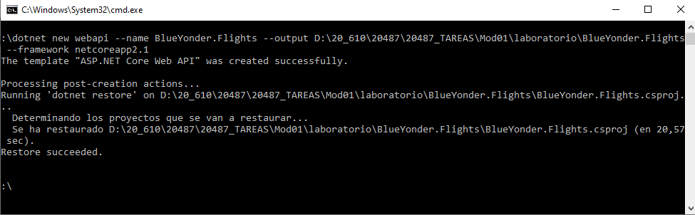


### Exercise 2: Creating a Simple Entity Framework Model

Para añaadir Entity Framework Core ejecutamos

```bash
dotnet add package Microsoft.EntityFrameworkCore.SqlServer --version=2.1.1
dotnet restore
```

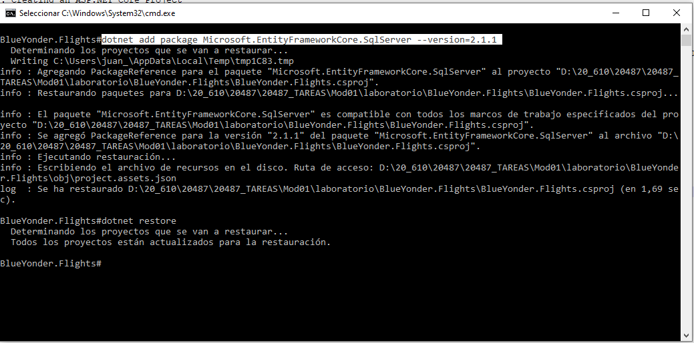

Desde code
creamos el modelo Flight [Models\Flight.cs](BlueYonder.Flights/Models/Flight.cs)
```c#
public class Flight
     {
         public int Id { get ;set; }
         public string Origin { get; set; }
         public string Destination { get; set; }
         public string FlightNumber { get; set; }
         public DateTime DepartureTime { get; set; }
     }
```

y la clase DBContext Models\FlightsContext.cs](BlueYonder.Flights/Models/FlightsContext.cs)
```c#
public class FlightsContext : DbContext
    {
        public FlightsContext(DbContextOptions<FlightsContext> options)
             : base(options)
        {
        }

        public DbSet<Flight> Flights { get; set; }
    }
```

Y por último añadimos la injection de dependicia en el [Startup.cs](BlueYonder.Flights/Startup.cs)

``` c#
.....
 using BlueYonder.Flights.Models;
 using Microsoft.EntityFrameworkCore;
 
 .....
  public void ConfigureServices(IServiceCollection services)
        {
            services.AddMvc().SetCompatibilityVersion(CompatibilityVersion.Version_2_1);
            services.AddDbContext<FlightsContext>(opt => opt.UseSqlServer(Configuration.GetConnectionString("defaultConnection")));
        }
 .....
``` 


### Exercise 3: Creating a Web API Class

Renombramos el controlador ValuesControllers.cs por [FlightsController.cs.](BlueYonder.Flights/Controllers/FlightsController.cs)
 
 y reemplazo el código por
```c#
 using System;
using System.Collections.Generic;
using System.Linq;
using System.Threading.Tasks;
using Microsoft.AspNetCore.Mvc;
using BlueYonder.Flights.Models;


namespace BlueYonder.Flights.Controllers
{
    [Route("api/[controller]")]
    [ApiController]
    public class FlightsController : ControllerBase
    {

        private readonly FlightsContext _context;
        public FlightsController(FlightsContext context)
        {
            _context = context;
        }

        // GET api/flights
        [HttpGet]
        public IEnumerable<Flight> Get()
        {
            return _context.Flights.ToList();
        }

        // POST api/flights
        [HttpPost]
        public IActionResult Post([FromBody]Flight flight)
        {
            _context.Flights.Add(flight);
            _context.SaveChanges();
            return CreatedAtAction(nameof(Get), flight.Id);
        }
    }
}
```


### Exercise 4: Deploying the Web Application to Azure

Creamos un nuevo recurso en azure Web App + SQL

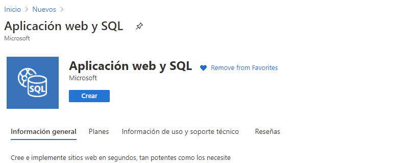

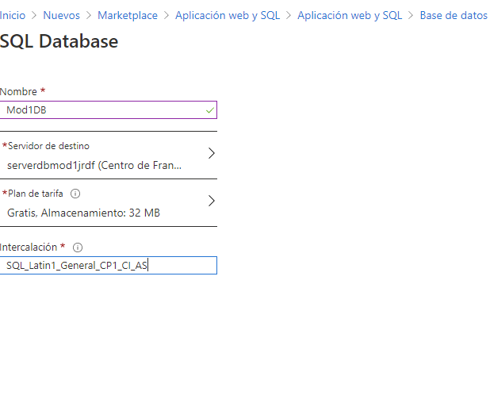


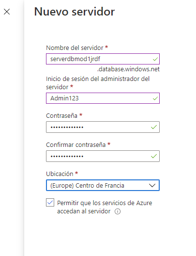


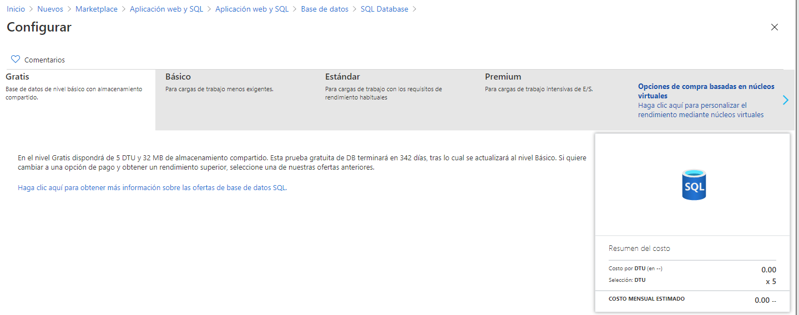


creamos la base de datos Mod1DB

configuramos el firewal

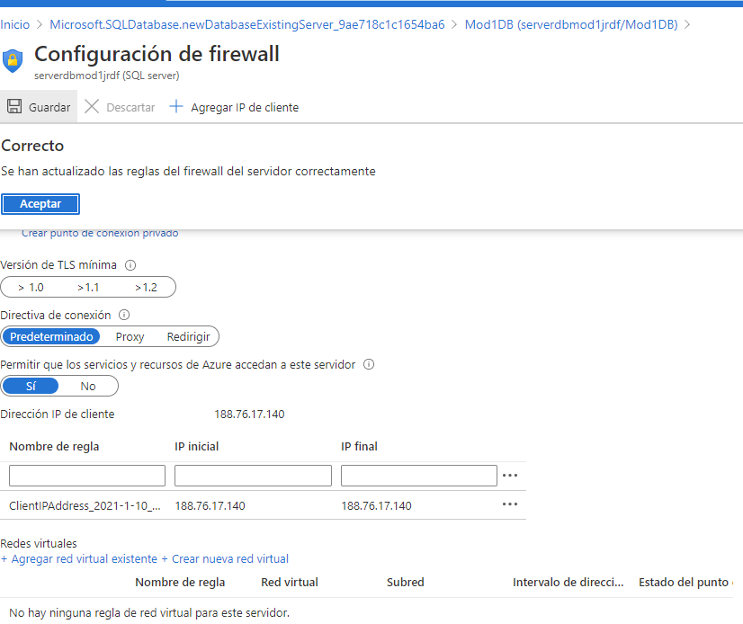

y creamos la tabla desde el editor de consultas

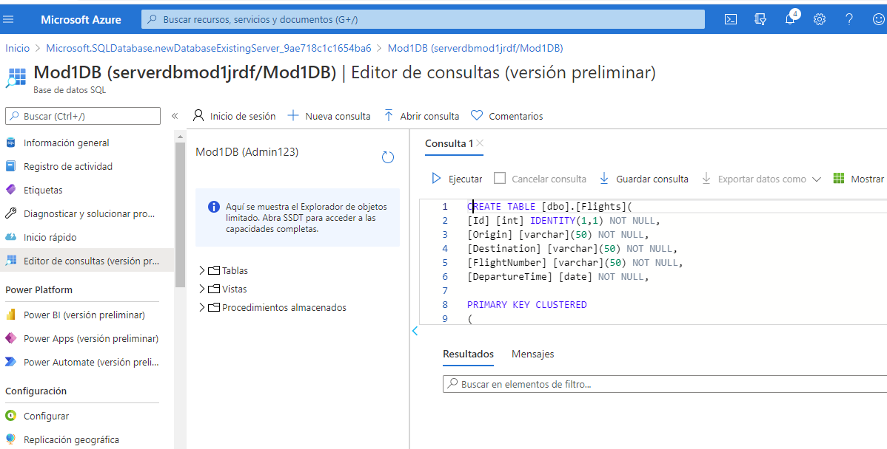


Task 2: Deploy the web application to the Azure Web App

Abrimos el AAp Service


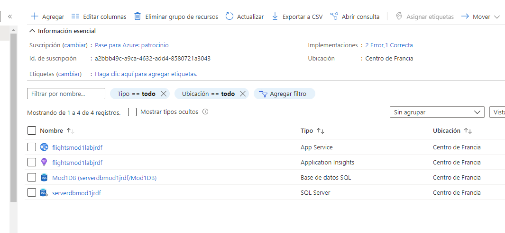

y añadimos la confguración ftp desde el centro de implementación

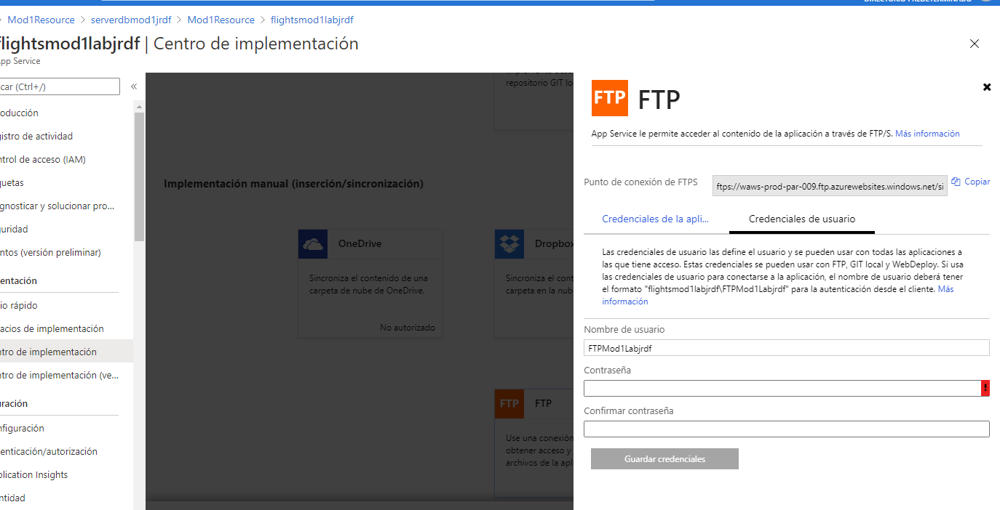

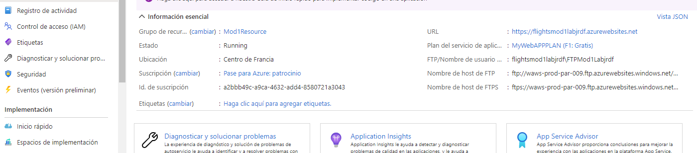


una vez configurado Aure volvemos al VScode y creamos el fichero [Properties\PublishProfiles\Azure.pubxml](BlueYonder.Flights/Properties/PublishProfiles/Azure.pubxml)


```xml
<Project>
    <PropertyGroup>
      <PublishProtocol>Kudu</PublishProtocol>
      <PublishSiteName>flightsmod1labjrdf</PublishSiteName>
      <UserName>FTPMod1Labjrdf</UserName>
      <Password>Pa$$word123</Password>
    </PropertyGroup>
</Project>
````

y ejcutamos

```bash
dotnet publish /p:PublishProfile=Azure /p:Configuration=Release
```

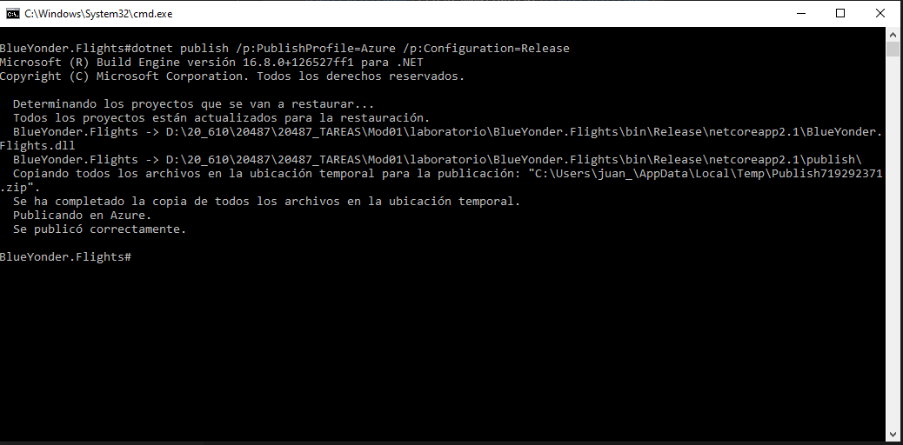


Task 3: Test the web API


Probamos la aplicación

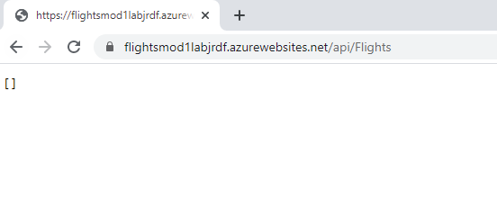
Tiene buena pinta ya que la base de datos está vacia

vamos a ñadir un valor desde Powersell


$postParams = "{'origin': 'Germany',
    'destination': 'France',
    'flightNumber': 'GF7625',
    'departureTime': '0001-01-01T00:00:00'}"
Invoke-WebRequest -Uri https://flightsmod1labjrdf.azurewebsites.net/api/Flights -ContentType "application/json" -Method POST -Body $postParams


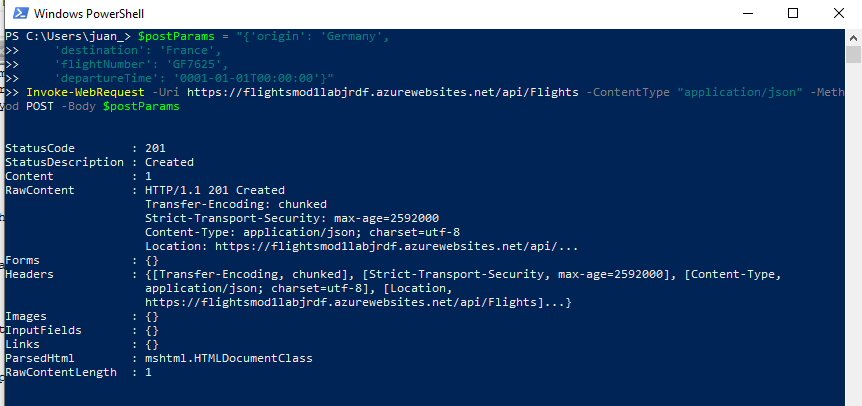

el valor ha sido añadido

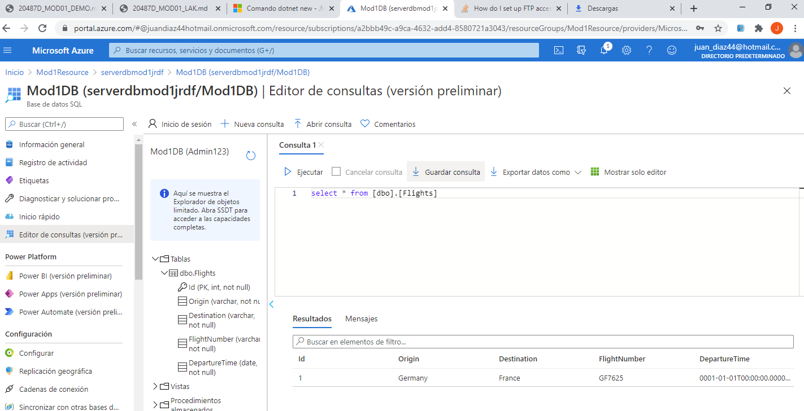

finalmente

Task 4: View result in the database


