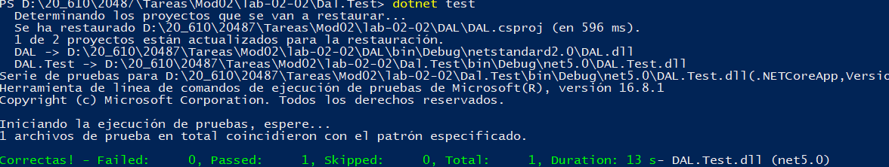
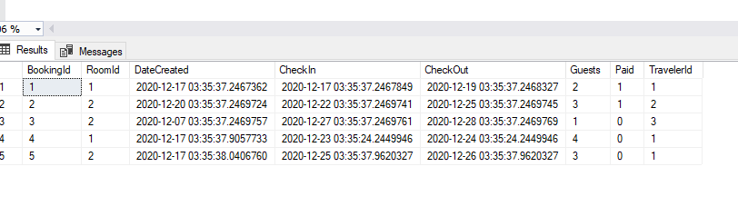
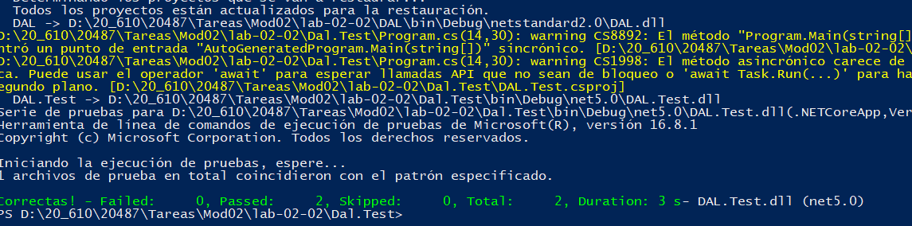
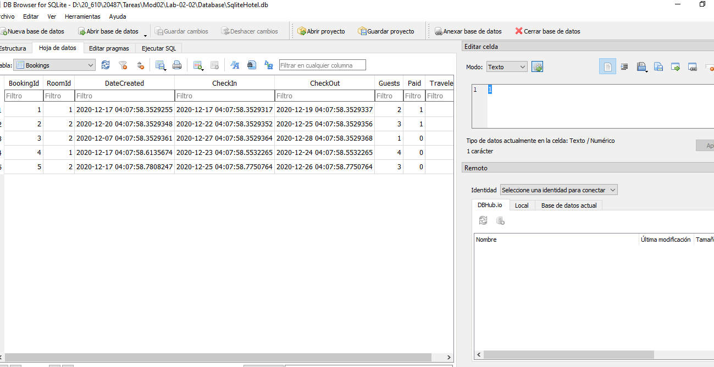

## Módulo 2: Consultar y manipular datos mediante Entity Framework

### Laboratorio: Creación de una capa de acceso a datos usando Entity Framework

Instrucciones: 
https://github.com/MicrosoftLearning/20487D-Developing-Microsoft-Azure-and-Web-Services/blob/master/Instructions/20487D_MOD02_LAK.md


En este caso partimos del laboratio del ejercicio anterior al cual se le ha añadido 


DAL.Repository.HotelBookingRepository](DAL/Repository/HotelBookingRepository.cs) vacio


nota: DatabaseTester en este caso no hace nada podia estar eliminado

al que le añadimos todo este código 

````
using DAL.Database;
using DAL.Models;
using System;
using System.Linq;
using Microsoft.EntityFrameworkCore;
using System.Threading.Tasks;
using System.Collections.Generic;

namespace DAL.Repository
{
    public class HotelBookingRepository
    {
        private DbContextOptions<MyDbContext> _options;

        public HotelBookingRepository()
        {
            _options = new DbContextOptionsBuilder<MyDbContext>()
                .UseSqlServer(@"Server=(LocalDB)\.;Database=Mod2Lab2DB;Trusted_Connection=True;")
                .Options;
        }

        public HotelBookingRepository(DbContextOptions<MyDbContext> options)
        {
            _options = options;
        }

        public async Task<Booking> Add(int travelerId, int roomId, DateTime checkIn, int guest = 1)
        {
            using (MyDbContext context = new MyDbContext(_options))
            {
                Traveler traveler = context.Travelers.FirstOrDefault(t => t.TravelerId == travelerId);
                Room room = context.Rooms.FirstOrDefault(r => r.RoomId == roomId);
                if (traveler != null && room != null)
                {
                    Booking newBooking = new Booking()
                    {
                        DateCreated = DateTime.Now,
                        CheckIn = checkIn,
                        CheckOut = checkIn.AddDays(1),
                        Guests = guest,
                        Paid = false,
                        Traveler = traveler,
                        Room = room
                    };
                    Booking booking = (await context.Bookings.AddAsync(newBooking))?.Entity;
                    await context.SaveChangesAsync();
                    return booking;
                }
                return null;
            }
        }
        public async Task<Booking> Update(Booking bookingToUpdate)
        {
            using (MyDbContext context = new MyDbContext(_options))
            {
                Booking booking = context.Bookings.Update(bookingToUpdate)?.Entity;
                await context.SaveChangesAsync();
                return booking;
            }
        }

        public async void Delete(int bookingId)
        {
            using (MyDbContext context = new MyDbContext(_options))
            {
                Booking booking = context.Bookings.FirstOrDefault(b => b.BookingId == bookingId);

                if (booking != null)
                {
                    context.Bookings.Remove(booking);
                    await context.SaveChangesAsync();
                }
            }
        }


    }
}

````


#### exercise 2: Test the model using SQL Server and SQLite


Quremos añadir un nuevo proyecto de Test a la solución para ello ejecutamos 

dotnet new mstest --name DAL.Test  


y le añadimos la refrencia Dal al [DAL.Test/DAL.Test.cjproj](DAL.Test/DAL.Test.cjproj)

````
<ItemGroup>
     <ProjectReference Include="..\DAL\DAL.csproj" />
</ItemGroup>
````


cambiamos de nombre UnitTest1.cs por BookingRepositoryTests.cs

Le añadimos el código a [BookingRepositoryTests]](DAL.Test/BookingRepositoryTests.cs)

````
using Microsoft.VisualStudio.TestTools.UnitTesting;
using System.Transactions;
using System;
using DAL.Repository;
using DAL.Models;
using DAL.Database;
using System.Threading.Tasks;
using System.Linq;
using Microsoft.EntityFrameworkCore;


namespace DAL.Test
{
    [TestClass]
    public class BookingRepositoryTests
    {
        [TestMethod]
        public async Task AddTwoBookingsTest()
        {
            Booking fristBooking;
            Booking secondBooking;
            using (TransactionScope scope = new TransactionScope(TransactionScopeOption.Required,
                    new TransactionOptions { IsolationLevel = IsolationLevel.ReadCommitted }, TransactionScopeAsyncFlowOption.Enabled))
            {
                HotelBookingRepository repository = new HotelBookingRepository();
                fristBooking = await repository.Add(1, 1, DateTime.Now.AddDays(6), 4);
                secondBooking = await repository.Add(1, 2, DateTime.Now.AddDays(8), 3);
                scope.Complete();
            }

            using (MyDbContext context = new MyDbContext())
            {
                int bookingsCounter = context.Bookings.Where(booking => booking.BookingId == fristBooking.BookingId ||
                                                                        booking.BookingId == secondBooking.BookingId).ToList().Count;
                Assert.AreEqual(2, bookingsCounter);
            }
        }
    }
}
````


Guardamo todo y ejecutamos el test

dotnet test


 


 


La base de datos no existe y es el test donde la crea 

cuando  HotelBookingRepository repository = new HotelBookingRepository();

y en su medoto add ves que inicializa una instancia de MyDbContext

el constructor de MyDbContext llama a  InitialDBContext(); que a su vez a      DbInitializer.Initialize(this);


despues isserta desde el test 


#### Task 3: Replace the SQL Server provider with SQLite


En el Dal instalamos ntity Framework Core SQlite,

dotnet add package Microsoft.EntityFrameworkCore.Sqlite --version=2.1.1


Modificamos [BookingRepositoryTests](DAL.Test/BookingRepositoryTests.cs)

````
public class UnitTest1
    {
            private DbContextOptions<MyDbContext> _options =
            new DbContextOptionsBuilder<MyDbContext>()
                .UseSqlite(@"Data Source = D:\20_610\20487\Tareas\Mod02\lab-02-02\Database\SqliteHotel.db")
                .Options;

				........
````

y añadimos nuevo metodo

````
        [TestMethod]
     public async Task AddTwoBookingsSQLiteTest()
     {
         using (MyDbContext context = new MyDbContext(_options))
         {

             HotelBookingRepository repository = new HotelBookingRepository(_options);
             Booking fristBooking = await repository.Add(1, 1, DateTime.Now.AddDays(6), 4);
             Booking secondBooking = await repository.Add(1, 2, DateTime.Now.AddDays(8), 3);

             int bookingsCounter = context.Bookings.Where(booking => booking.BookingId == fristBooking.BookingId ||
                                                                     booking.BookingId == secondBooking.BookingId).ToList().Count;

             Assert.AreEqual(2, bookingsCounter);
         }
     }

````


y ejecutamos de nuevo dotnet.test



Abrimos con SQLLite Browser

