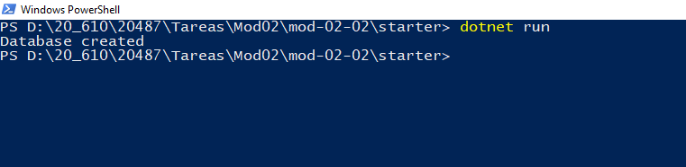
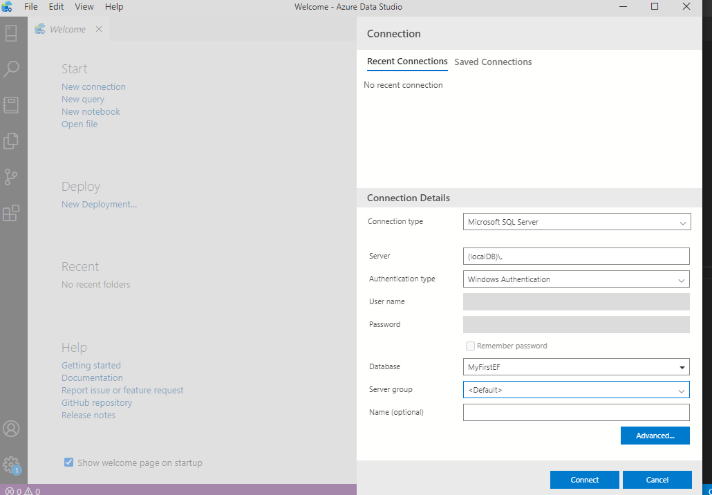
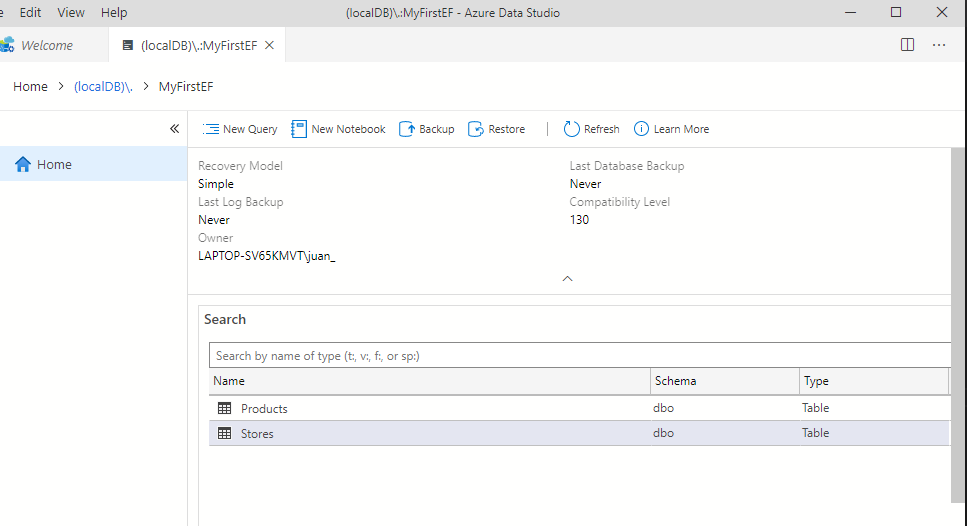

## Módulo 2: Consultar y manipular datos mediante Entity Framework

### Lección 2: Creación de un modelo de datos de entidad

#### Demostración: creación de un tipo de entidad, DbContext y DbInitializer

Creamos un proyecto de consola 

dotnet new console --name MyFirstE --output Starter   

Le añadimos el EntityFrameworkCore 2.1.1

dotnet add package Microsoft.EntityFrameworkCore.SqlServer --version=2.1.1
dotnet restore

Desde Code creamos los models Product y Store
EL dbContext y el Inicialidor de la base de datos
y modificamos el Main para que llame a Inicializar el contexto

ejectutamos  

Nos conectamos a (localDB)\. desde Azure Data Studio

Y vemos que la Base de datos ha sido creada

