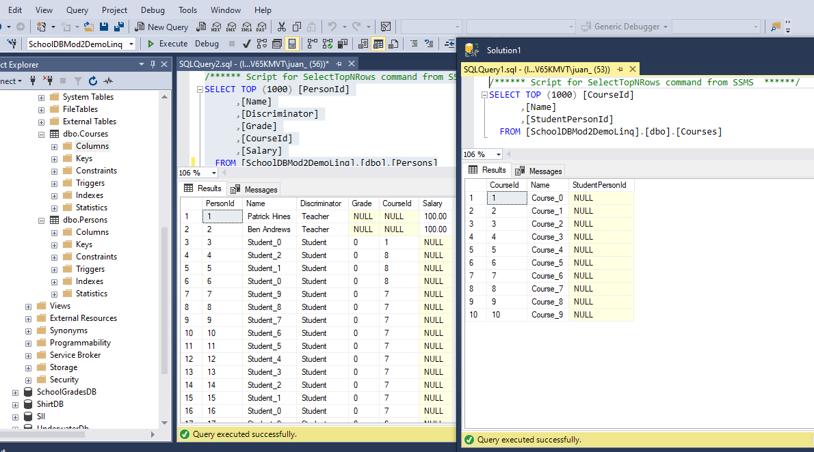

## Lesson 3: Querying Data

### Demonstration: Using Language-Integrated Query (LINQ) to Entities


Se trata de practicar consultas linq a traves de EF


UsingLINQtoEntity.csproj
Contiene
```
  <ItemGroup>
    <PackageReference Include="Microsoft.EntityFrameworkCore.SqlServer" Version="2.1.1" />
    <PackageReference Include="Microsoft.EntityFrameworkCore.Proxies" Version="2.1.1" />
  </ItemGroup>
```

Por lo que ejecutamos dotnet restore para restaurar las dependencias

El Modelo se compone de :
[Course.cs](Models/Course.cs) ,   
[Person.cs](Models/Person.cs) ,   
[Student.cs](Models/Student.cs),   
[Course.cs](Models/Teacher.cs) 


El programa hace lo siguiente:

Program.cs
```c#
using (var context = new SchoolContext())
{
    DbInitializer.Initialize(context);
....
```

DbInitializer  

```c#
public static void Initialize(SchoolContext context)
    {
        // Code to create initial data
    if(context.Database.EnsureCreated())
    {
        // Add data to the database
        Seed(context);
    }
}
```

La llamada a  context.Database.EnsureCreated() es la que se encarga de crear la base de datos 
ya que llama a los metodos  OnConfiguring y OnModelCreating de SchoolContext  

SchoolContext  
```c#
protected override void OnConfiguring(DbContextOptionsBuilder optionsBuilder)
{ 
    optionsBuilder.UseLazyLoadingProxies().UseSqlServer(@"Server=(localDB)\.;Database=SchoolDBMod2DemoLinq;Trusted_Connection=True;");
}

protected override void OnModelCreating(ModelBuilder modelBuilder)
{
    modelBuilder.Entity<Course>().HasMany(x => x.Students);
    modelBuilder.Entity<Student>().HasMany(x => x.Courses);
}
```


context.Database.EnsureCreated() crea la base de datos si no existe y devuelve true si la creo y false si no
Entonce volciendo a Initialite

si true lanza Seed(context); que inserta dos profesores y despues en un bucle inserta los cursos
```c#
var englishTeacher = new Teacher { Name = "Ben Andrews", Salary = 200000, };
var mathTeacher = new Teacher { Name = "Patrick Hines", Salary = 250000, };
context.Teachers.Add(mathTeacher);
context.Teachers.Add(englishTeacher);
....
    context.SaveChanges();
```

finalmente presentamos los datos on una consulta LinQ
```c#
var cursos = from c in context.Courses select c;
foreach (var curso in cursos)
{
    System.Console.WriteLine($"Curso name: {curso.Name}");
    foreach (var student in curso.Students)
            {
            System.Console.WriteLine($"Student name: {student.Name}");
            }          
}
```` 

Salida


EF crea la base de datos según el Módelo pero la crea según su criterio




