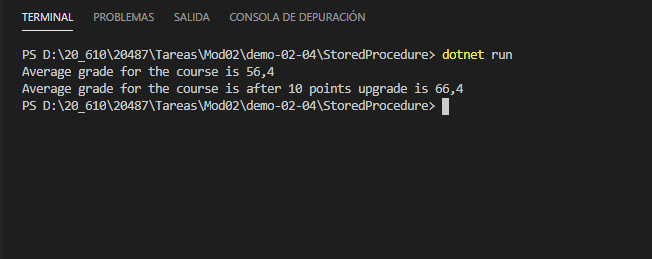
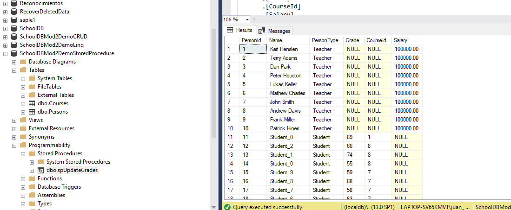

### Demonstration 2: Running Stored Procedures with Entity Framework

En esta ocasión crea la base de datos del mismo modo que en la practica anterior 

Lammada desde program
```c#
  using(var context = new SchoolContext())
            {
                DbInitializer.Initialize(context);
  ......
````
DbInitializer.Initialize utiliza el context.Database.EnsureCreated() 
```c#
public static void Initialize(SchoolContext context)
         {
             // Code to create initial data
            if(context.Database.EnsureCreated())
            {
                // Add data to the database
                Seed(context);
            }

         }
```

con lo cual llamara a los métodos OnConfiguring que crea la base y  
OnModelCreating que añade integridad referencial y en este caso ademas le dice que el modelBuilder.Entity<Person>().HasDiscriminator<string>("PersonType");

```c#
protected override void OnConfiguring(DbContextOptionsBuilder optionsBuilder)
{ 
    optionsBuilder.UseLazyLoadingProxies().UseSqlServer(@"Server=(localDB)\.;Database=SchoolDBMod2DemoStoredProcedure;Trusted_Connection=True;");
}

protected override void OnModelCreating(ModelBuilder modelBuilder)
{
    modelBuilder.Entity<Course>().HasMany(x => x.Students);
    modelBuilder.Entity<Student>().HasMany(x => x.Courses);

    modelBuilder.Entity<Person>()
                .HasDiscriminator<string>("PersonType");

}
```
 

Si se crea la base de datos DbInitializer.Initialize(context); llama a Seed(context)  
que añade Cursos y teachers y  
llama al procedimiento alamcenado spUpdateGrades utilizando context.Database.ExecuteSqlCommand(cmdCreateProcedure);  

nota: no lo vuelve a crear en sucesisvas llamadas, de hecho si es modificado en bbdd llama al modificado

```c#

 public static void Seed(SchoolContext context)
         {
             // Creating a fictitious teacher names
            List<string> TeacherNames = new List<string>() { "Kari Hensien", "Terry Adams", "Dan Park", "Peter Houston", "Lukas Keller", "Mathew Charles", "John Smith", "Andrew Davis", "Frank Miller", "Patrick Hines" };

            List<string> CourseNames = new List<string>() { "WCF", "WFP", "ASP.NET Core", "Advanced .Net", ".Net Performance", "LINQ", "Entity Frameword","Universal Windows" ,"Microsoft Azure", "Production Debugging" };

            // Generating ten courses
            for (int i = 0; i < 10; i++)
            {
                var teacher = new Teacher() { Name = TeacherNames[i], Salary = 100000 };
                var course = new Course { Name = CourseNames[i], CourseTeacher = teacher, Students = new List<Student>() };

                Random rand = new Random(i);

                // For each course, generating ten students and assigning them to the current course
                for (int j = 0; j < 10; j++)
                {
                    var student = new Student {  Name = "Student_" + j, Grade = rand.Next(40,80)};
                    course.Students.Add(student);
                }
                context.Courses.Add(course);
                context.Teachers.Add(teacher);
            }

            // Defining stored procedure that accepts CourceName and GradeChange as parameters and updates the grade to all the students in the course
            string cmdCreateProcedure = @"CREATE PROCEDURE spUpdateGrades @CourseName nvarchar(30), @GradeChange int
                                        AS
                                        BEGIN
	                                        DECLARE @CourseId int
                                            SELECT @CourseId = CourseId 
                                            FROM Courses 
                                            WHERE  Name = 'ASP.NET Core' 
                                            UPDATE Persons SET Grade = (CASE WHEN (Grade + 10) <= 100 THEN (Grade + 10)
                                            								ELSE 100
                                            								END )
                                            WHERE PersonType = 'Student' 
                                                  AND CourseId = @CourseId
                                            END";
            
            // Creating the stored procedure in database
            context.Database.ExecuteSqlCommand(cmdCreateProcedure);

            // Saving the changes to the database
            context.SaveChanges();
         }

```




