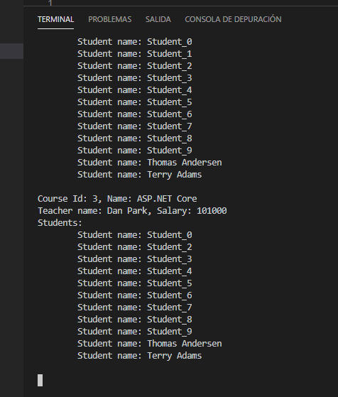
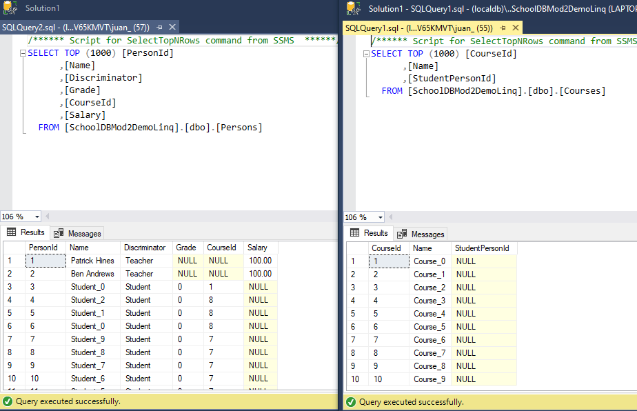

## Module 2: Querying and Manipulating Data Using Entity Framework

### Demo: Lesson 4: Manipulating Data

#### Demonstration: CRUD Operations in Entity Framework

de la misma manera que en las demos antereriores nos creamos una base de datos e insertamos unos datos iniciales

```c#

using (var context = new SchoolContext())
	{
	DbInitializer.Initialize(context);
	..........

	
	
public static void Initialize(SchoolContext context)
 {
	 // Code to create initial data
	if(context.Database.EnsureCreated())
	{
		// Add data to the database
		Seed(context);
	}

 }
 
 
 .....
 
  public class SchoolContext : DbContext
    {
        public virtual DbSet<Person> Persons { get; set; }
        public virtual DbSet<Student> Students { get; set; }
        public virtual DbSet<Teacher> Teachers { get; set; }
        public virtual DbSet<Course> Courses { get; set; }

        protected override void OnConfiguring(DbContextOptionsBuilder optionsBuilder)
        { 
            optionsBuilder.UseLazyLoadingProxies().UseSqlServer(@"Server=(localDB)\.;Database=SchoolDBMod2DemoCRUD;Trusted_Connection=True;");
        }

        protected override void OnModelCreating(ModelBuilder modelBuilder)
        {
            modelBuilder.Entity<Course>().HasMany(x => x.Students);
            modelBuilder.Entity<Student>().HasMany(x => x.Courses);
        }
    }
	
.........


         public static void Seed(SchoolContext context)
         {
            // Creating a fictitious teacher names
            List<string> TeacherNames = new List<string>() { "Kari Hensien", "Terry Adams", "Dan Park", "Peter Houston", "Lukas Keller", "Mathew Charles", "John Smith", "Andrew Davis", "Frank Miller", "Patrick Hines" };

            List<string> CourseNames = new List<string>() { "WCF", "WFP", "ASP.NET Core", "Advanced .Net", ".Net Performance", "LINQ", "Entity Frameword","Universal Windows" ,"Microsoft Azure", "Production Debugging" };
            // Generating ten courses
            for (int i = 0; i < 10; i++)
            {
                var teacher = new Teacher() { Name = TeacherNames[i], Salary = 100000 };
                var course = new Course { Name = CourseNames[i], CourseTeacher = teacher,  Students = new List<Student>()};
                

                Random rand = new Random(i);

                // For each course, generating ten students and assigning them to the current course
                for (int j = 0; j < 10; j++)
                {
                    var student = new Student {  Name = "Student_" + j, Grade = rand.Next(40,90)};
                    course.Students.Add(student);
                }
                
                context.Courses.Add(course);
                context.Teachers.Add(teacher);
            }

            // Saving the changes to the database
            context.SaveChanges();
         }
......

````

una vez que esta creada vamos a realizar un CRUD

```c#
	Course ASPCourse = (from course in context.Courses
                                        where course.Name == "ASP.NET Core"
                                        select course).Single();

	// Creamos dos estudiantes
	Student firstStudent = new Student() { Name = "Thomas Andersen" };
	Student secondStudent = new Student() { Name = "Terry Adams" };

	// añadimos los estudiantes al cudros
	ASPCourse.Students.Add(firstStudent);
	ASPCourse.Students.Add(secondStudent);


	System.Console.WriteLine(ASPCourse);
   // Aumentamos el salario del profesor
	ASPCourse.CourseTeacher.Salary += 1000;

	// Getting a student called Student_1
	Student studentToRemove = ASPCourse.Students.FirstOrDefault((student) => student.Name == "Student_1");

	// Remove a student from the WCF course
	ASPCourse.Students.Remove(studentToRemove);

	context.SaveChanges();

	// Print the course details to the console
	Console.WriteLine(ASPCourse);
	Console.ReadLine();

````



