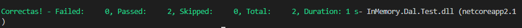

## Module 2: Querying and Manipulating Data Using Entity Framework

### Demo: Lesson 4: Manipulating Data

#### Demonstration: Using Entity Framework with In-Memory Database


En esta ocasión, creamos un repositorio y vamos a lanzar un proyecto de prueba.


En la Capa de Datos creamos la base de datos de la misma manera que en las prácticas anteriores pero utilizamos repositorio Dal.StudentRepository.cs y Dal.TeacherRepository.cs para acceder a ella.


```c#
   public class StudentRepository
    {
        private DbContextOptions<SchoolContext> _options;
        public StudentRepository(DbContextOptions<SchoolContext> options)
        {
            _options = options;
        }

        public Student Add(Student student)
        {
            try
            {
                using (var context = new SchoolContext(_options))
                {
                    DbInitializer.Initialize(context);
                    var result = context.Students.Add(student).Entity;
                    context.SaveChanges();
                    return result;
                }
            }
            catch (Exception ex)
            {
                System.Console.WriteLine(ex);
                return null;
            }
        }
    }
    public class TeacherRepository
    {
        private DbContextOptions<SchoolContext> _options;
        public TeacherRepository(DbContextOptions<SchoolContext> options)
        {
            _options = options;
        }

        public Teacher Add(Teacher teacher)
        {
            try
            {
                using (var context = new SchoolContext(_options))
                {
                    DbInitializer.Initialize(context);
                    var result = context.Teachers.Add(teacher).Entity;
                    context.SaveChanges();
                    return result;
                }
            }
            catch (Exception ex)
            {
                System.Console.WriteLine(ex);
                return null;
            }
        }
        public Teacher Update(Teacher teacher)
        {
            try
            {
                using (var context = new SchoolContext(_options))
                {
                    DbInitializer.Initialize(context);
                    var result = context.Teachers.Update(teacher).Entity;
                    context.SaveChanges();
                    return result;
                }
            }
            catch (Exception ex)
            {
                System.Console.WriteLine(ex);
                return null;
            }
        }
    }
```

La clase TEST utiliza un contexto pero con la opción in memory  
injectará el repositorio Dal.StudentRepository.cs y Dal.TeacherRepository.cs y les pasa este contexto.  
De tal manera que cuando llama al metodo Add lo hace sobre el contexto pasado


```c#
[TestClass]
    public class DBInMemoryTest
    {
        private StudentRepository _studentRepository;
        private TeacherRepository _teacherRepository;

        private DbContextOptions<SchoolContext> _options =
                    new DbContextOptionsBuilder<SchoolContext>()
                        .UseInMemoryDatabase(databaseName: "TestDatabase")
                        .Options;

        public DBInMemoryTest()
        {
            _studentRepository = new StudentRepository(_options);
            _teacherRepository = new TeacherRepository(_options);
        }

        [TestMethod]
        public void AddStudentTest()
        {
            Student student = new Student { Name = "Kari Hensien" };
            student = _studentRepository.Add(student);

            using (var context = new SchoolContext(_options))
            {
                var result = context.Students.FirstOrDefault((s) => s.PersonId == student.PersonId);
                Assert.IsNotNull(result);
            }
        }
        [TestMethod]
        public void UpdateTeacherSalaryTest()
        {
            Teacher teacher = new Teacher { Name = "Terry Adams", Salary = 10000 };
            teacher = _teacherRepository.Add(teacher);
            teacher.Salary += 10000;
            teacher = _teacherRepository.Update(teacher);

            using (var context = new SchoolContext(_options))
            {
                var result = context.Teachers.FirstOrDefault((s) => s.PersonId == teacher.PersonId);
                Assert.AreEqual(result.Salary, 20000);
            }
        }
    }
```

probamos la aplicación ejecutando dotnet test



A ejecutado las pruebas sobre una base de datos en memoria y no se ha creado la base de datos física.