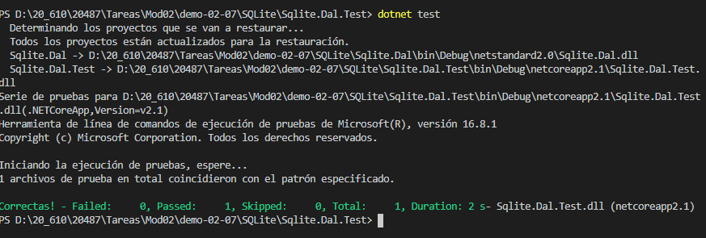
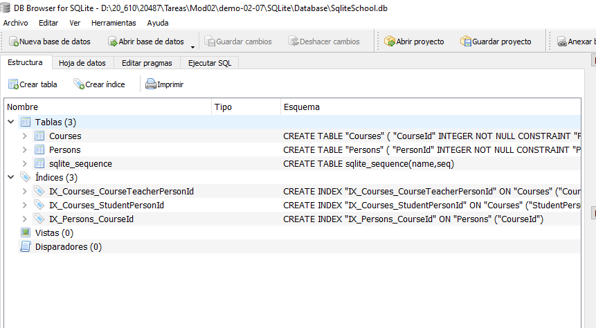

## Module 2: Querying and Manipulating Data Using Entity Framework

### Demo: Lesson 4: Manipulating Data

#### Demonstration: Using Entity Framework with SQLite

Es la misma práctica que el ejercicio Imemory pero esta vez la lase test utilza una base de datos Sqlite

```c#
....
private DbContextOptions<SchoolContext> _options =
                new DbContextOptionsBuilder<SchoolContext>()
                    .UseSqlite(@"Data Source = D:\20_610\20487\Tareas\Mod02\demo-02-07\SQLite\Database\SqliteSchool.db")
                    .Options;
....
```








