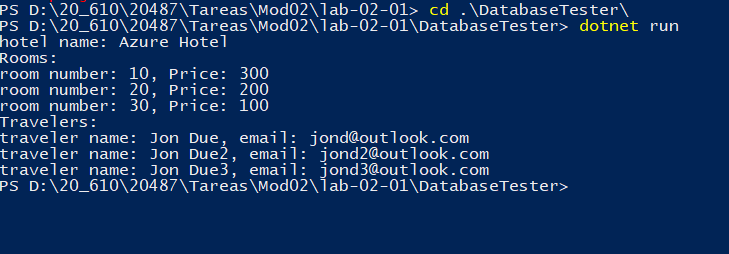

## Módulo 2: Consultar y manipular datos mediante Entity Framework

### Laboratorio: Creación de una capa de acceso a datos usando Entity Framework

Instrucciones: 
https://github.com/MicrosoftLearning/20487D-Developing-Microsoft-Azure-and-Web-Services/blob/master/Instructions/20487D_MOD02_LAK.md

Creamos la capa de datos

dotnet new classlib --name DAL --output \DAL

Añadimos EntityFrameworkCore

dotnet add package Microsoft.EntityFrameworkCore.SqlServer --version=2.1.1
dotnet restore


Abrimos con Code

y nos creamos:  
[DAL.Models.Booking.cs](DAL/Models/Booking.cs)   
[DAL.Models.Hotel.cs](DAL/Models/Booking.cs)   
[DAL.Models.Room.cs](DAL/Models/Booking.cs)  
[DAL.Models.Traveler.cs](DAL/Models/Booking.cs)  

Seguidamente el Contexto:  
tendrá un DBset por cada uno de los modelos, la inicializacion y en el OnConfiguring la ruta de la base de datos    
[DAL.Database.MyDbContext](DAL/Database/MyDbContext.cs)   

Vamos a crear un [DAL.Database.DbInitializer](DAL/Database/DbInitializer.cs)    

este tiene el método para rellenar la base de datos si debe ser creada
````
public static void Initialize(MyDbContext context)
{
 if(context.Database.EnsureCreated())
 {
	 // Code to create initial data
	 Seed(context);
 }
}
````

Con ello termnariamos la capa Dal

Creamos un Proyecto DataTester

dotnet new console --name DatabaseTester --output DatabaseTester 

y como lo que queremos es que amos esten en la misma solucion 

 dotnet new sln --name Mod2Lab1  
 dotnet sln Mod2Lab1.sln add DAL\DAL.csproj  
 dotnet sln Mod2Lab1.sln add DatabaseTester\DatabaseTester.csproj  
 
 y lo abrimos con code
 
 Para añadir la referencia al Dal añadimos a [DatabaseTester.csproj](DatabaseTester/DatabaseTester.csproj)
  
 ```
 <ItemGroup>
     <ProjectReference Include="..\DAL\DAL.csproj" />
 </ItemGroup>
 ````
 
 y modificamos el Program para que ejcute una serie de consultas 
 
 ````
 using (MyDbContext context = new MyDbContext())
{
    DbInitializer.Initialize(context);

    Hotel hotel = context.Hotels.FirstOrDefault();
    Console.WriteLine($"hotel name: {hotel.Name}");

    Console.WriteLine("Rooms:");
    foreach (Room room in context.Rooms.ToList())
        Console.WriteLine($"room number: {room.Number}, Price: {room.Price}");

    Console.WriteLine("Travelers:");
    foreach (Traveler traveler in context.Travelers.ToList())
        Console.WriteLine($"traveler name: {traveler.Name}, email: {traveler.Email} ");
}
````

y ejecutamos



 