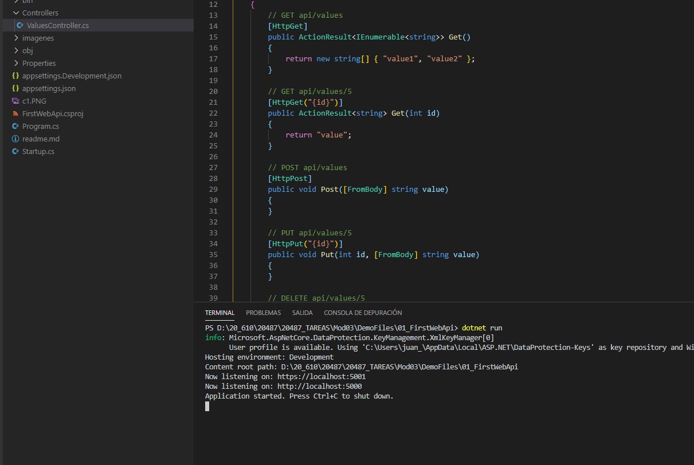
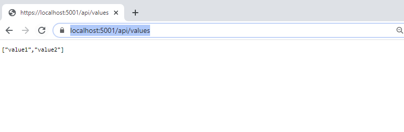

## Module 3: Creating and Consuming ASP.NET Core Web APIs

### Lesson 2: Creating an ASP.NET Core Web API

#### Creating Your First ASP.NET Core Web API


Demo realizada en clase 

Para crear una web api basta con ejecutar dotnet new webapi --name {Name} --output {Ruta de la Solucón}

```c#
dotnet new webapi --name MyFirstEF --output D:\20_610\20487\20487_TAREAS\Mod03\DemoFiles\01_FirstWebApi
```


Le ejecutamos un dotnet restore  

Abrimos con Code

y ejecutamos




