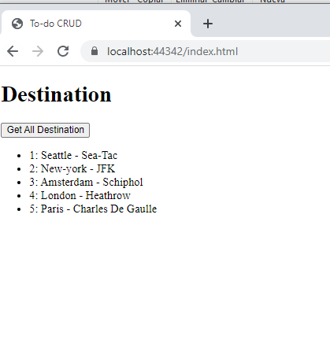

## Module 3: Creating and Consuming ASP.NET Core Web APIs

### Lesson 3: Consuming ASP.NET Core Web APIs

#### Demonstration: Consuming Services by Using JavaScript


Nos vamos a la carpeta del proyecto 02_JavaScriptClient

y le damos un dotnet restore

Entonces abrimos la solución con Visual Code  


El proyecto es muy sencillo nos centraremos en el Controllador [DestinationsController](Controllers/DestinationsController.cs)

```c#
	[Route("api/[controller]")]
    [ApiController]
    public class DestinationsController : ControllerBase
    {
        private List<Destination> _destinations;
        public DestinationsController()
        {
            _destinations = new List<Destination>();

            _destinations.Add(new Destination { Id = 1, CityName = "Seattle", Airport = "Sea-Tac" });
            _destinations.Add(new Destination { Id = 2, CityName = "New-york", Airport = "JFK" });
            _destinations.Add(new Destination { Id = 3, CityName = "Amsterdam", Airport = "Schiphol" });
            _destinations.Add(new Destination { Id = 4, CityName = "London", Airport = "Heathrow" });
            _destinations.Add(new Destination { Id = 5, CityName = "Paris", Airport = "Charles De Gaulle" });
        }

        // GET api/values
        [HttpGet]
        public ActionResult<IEnumerable<Destination>> Get()
        {
             return _destinations;
        }

        // GET api/values/5
        [HttpGet("{id}")]
        public Destination Get(int id)
        {
            var destination = _destinations.Where(d => d.Id == id).FirstOrDefault();

             return destination;
        }
	......
	}
```

Bien la demo sólo consiste en crear un get de javascript en [index.html](wwwroot/index.html) 


```c#
const uri = 'api/Destinations';


function getData(){
    //fetch api default method is GET  
    fetch(uri)
    .then(response => response.json())
    .then(function(data){
        console.log(data);
        data.forEach(value => {
            document.getElementById('destinations').innerHTML += '<li id="' + value.id + '">'  + value.id + ': ' + value.cityName + ' - ' + value.airport + '</li>';
        });
    })
   }

 ```
 
 añadimos un buton a [index.html](wwwroot/index.html) 
 ```html
 <button onclick="getData()">Get All Destination</button>
 ```
 
 
 
 y ejecutamos
 
 
 
 

