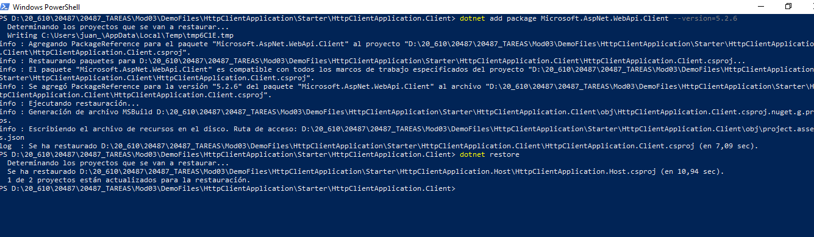
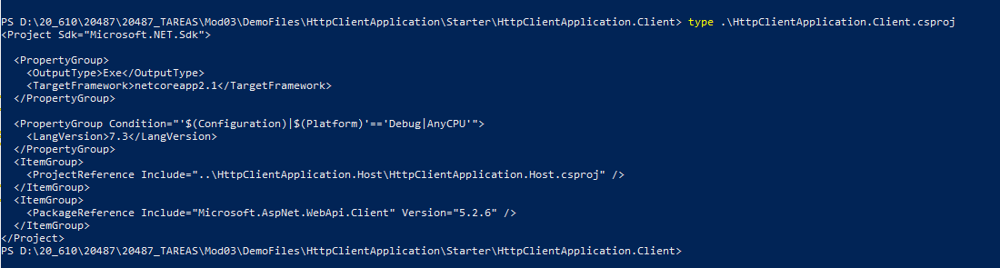
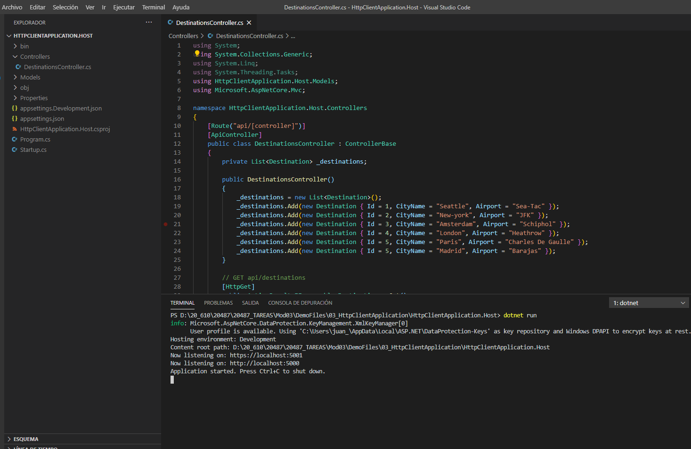
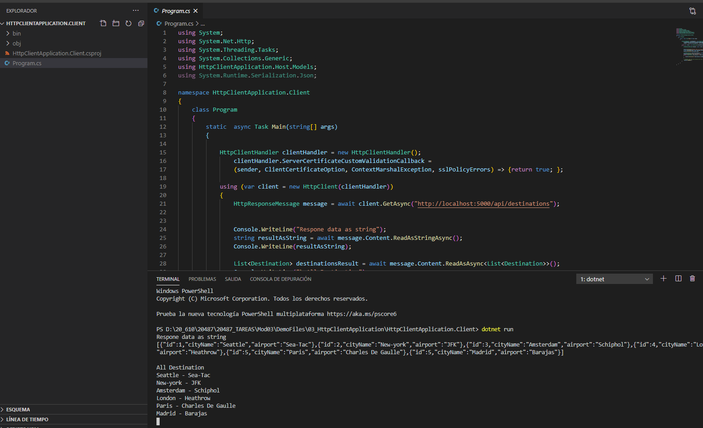

## Module 3: Creating and Consuming ASP.NET Core Web APIs

### Lesson 3: Consuming ASP.NET Core Web APIs

#### Demonstration: Consuming Services by Using HttpClient


instalamos Microsoft.AspNet.WebApi.Client --version=5.2.6 en \HttpClientApplication.Client

```bash
dotnet add package Microsoft.AspNet.WebApi.Client --version=5.2.6
dotnet restore
```







Abrimos el Proyecto HttpClient con Code


y modificamos el [Program.cs](HttpClientApplication.Client/Program.cs)


```c#

using System;
using System.Net.Http;
using System.Threading.Tasks;
using System.Collections.Generic;
using HttpClientApplication.Host.Models;
using System.Runtime.Serialization.Json;

namespace HttpClientApplication.Client
{
    class Program
    {
        static  async Task Main(string[] args)
        {
          
            using (var client = new HttpClient())
            {
                HttpResponseMessage message = await client.GetAsync("http://localhost:5000/api/destinations");
                
                
                Console.WriteLine("Respone data as string");
                string resultAsString = await message.Content.ReadAsStringAsync();
                Console.WriteLine(resultAsString);

                List<Destination> destinationsResult = await message.Content.ReadAsAsync<List<Destination>>();
                Console.WriteLine("\nAll Destination");
                foreach (Destination destination in destinationsResult)
                {
                    Console.WriteLine($"{destination.CityName} - {destination.Airport}");
                }

                // ReadKey used that the console will not close when the code end to run.
                 Console.ReadKey();
            }

        }
    }
}

```

En caso de tener problemas con el certificado bastaría con

```c#

................
    class Program
    {
        static  async Task Main(string[] args)
        {

            HttpClientHandler clientHandler = new HttpClientHandler();
                clientHandler.ServerCertificateCustomValidationCallback =
                (sender, ClientCertificateOption, ContextMarshalException, sslPolicyErrors) => {return true; };

            using (var client = new HttpClient(clientHandler))
			{
			
			...................
}


```

Para probar la aplicación ejecutar en un terminal el server y en otro terminal el cliente





