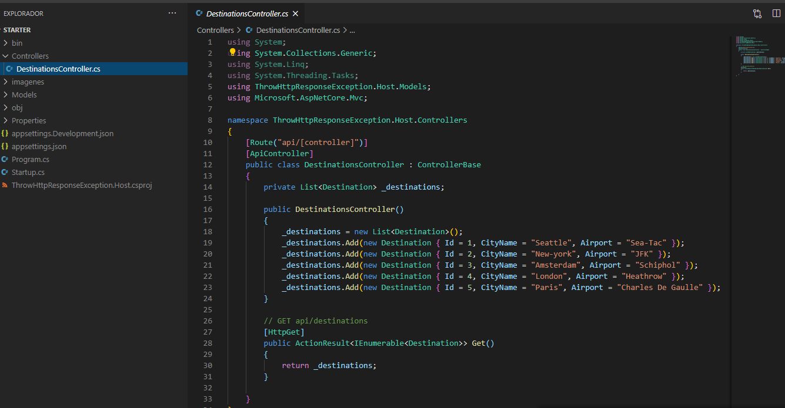
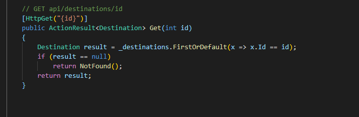
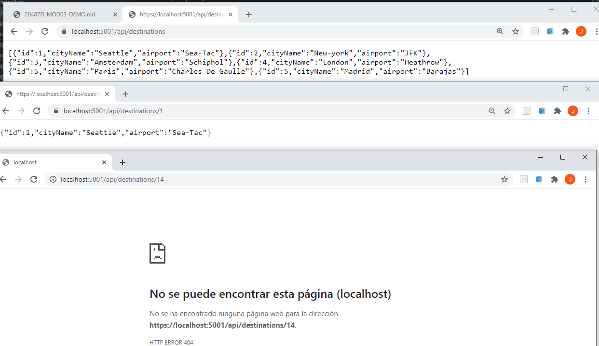

## Module 3: Creating and Consuming ASP.NET Core Web APIs

### Lesson 4: Handling HTTP Requests and Responses

#### Demonstration: Throwing Exceptions

Esta demo es simplemente para ver si no existe dato devolver un 404

Insertamos el siguiete método

Y observamos la salida

