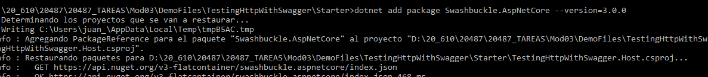
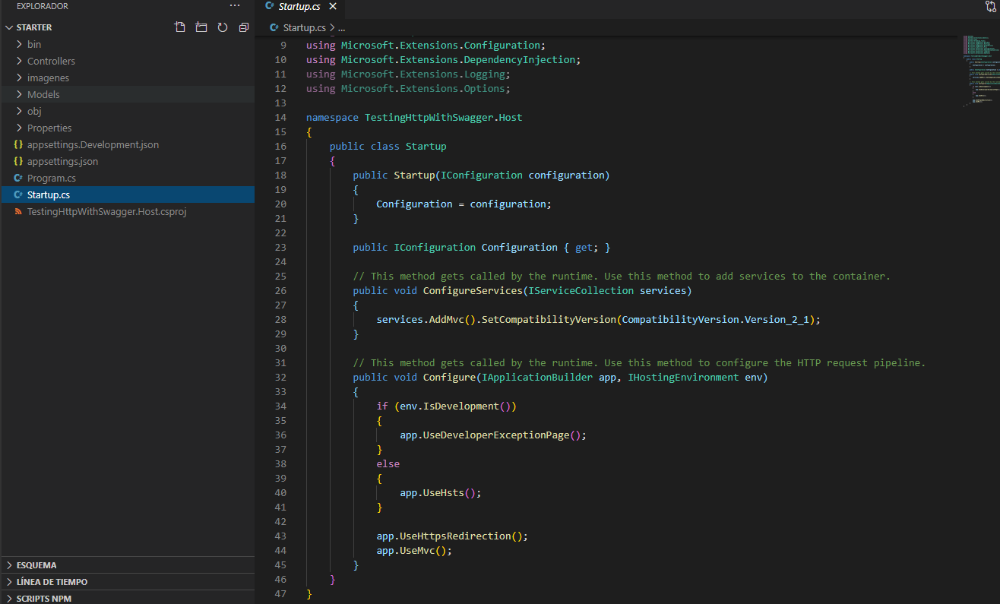
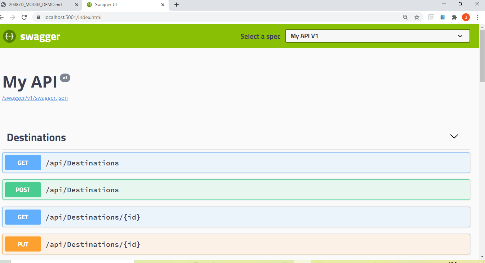
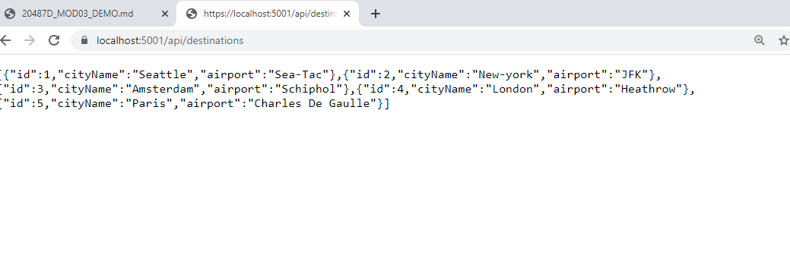
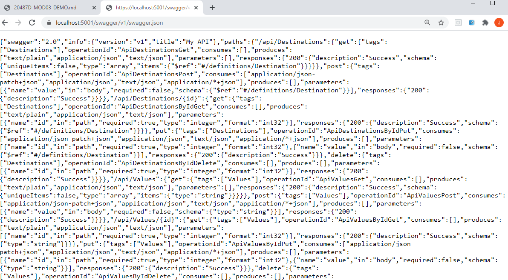

## Module 3: Creating and Consuming ASP.NET Core Web APIs

### Lesson 5: Automatically Generating HTTP Requests and Responses

#### Demonstration: Testing HTTP requests with Swagger


En la carpera del proyecto ejecutamos 

```bach
dotnet add package Swashbuckle.AspNetCore --version=3.0.0
dotnet restore
```




Abimos el Proyecto con Visual Code. Vemos el [Starup.cs](Startup.cs)




 le modificamos 
 
 
 ```c# 
 .......
  using Swashbuckle.AspNetCore.Swagger;
  
 ........
 
 public void ConfigureServices(IServiceCollection services)
        {
            services.AddSwaggerGen(c =>
            {
                c.SwaggerDoc("v1", new Info { Title = "My API", Version = "v1" });
            });
 
			........
 
 
 public void Configure(IApplicationBuilder app, IHostingEnvironment env)
		{
			app.UseSwagger();
			app.UseSwaggerUI(c =>
			{
				c.SwaggerEndpoint("/swagger/v1/swagger.json", "My API V1");
				c.RoutePrefix = string.Empty;
			});
			........
			
			
```		
			
Ejecutamos el proyecto ....			
	





