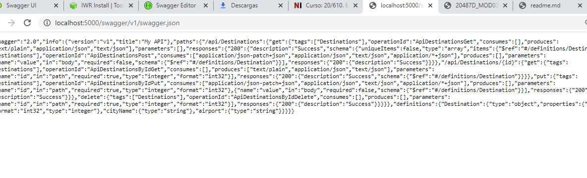

## Module 3: Creating and Consuming ASP.NET Core Web APIs

### Lesson 5: Automatically Generating HTTP Requests and Responses

#### Demonstration: Testing HTTP requests with Swagger


Primero instalamos en la carpeta AutoRest.Host la útlima versión de autorest. __OJO cambia con respecto al marckdown!!!!!__  

__EJECUTA ESTO y no la VERSION DEL MARKDOWN__

Por eso ejecutamos estos dos comandos desde PowerShell  (no hace falta abrir como Administrador)
```bash
npm install -g autorest 

autorest --rest
``` 


una vez instalado hacemos dotnet run para ver que funcione


Para no ver temas de ssl ponemos en el navegador http://localhost:5000

Carga el Swagger  


y tambien la api  


y el json del swagger 




bien dejamos el http://localhost:5000 funcionando y abrimos otro terminal y nos vamos al proyecto AutoRest.SDK y le ejecutamos un dotnet restore  


Este proyecto no tiene nada más que AutoRest.Sdk.csproj

Bueno aqui tendremos dos opciones la larga y la corta, vamos a por la corta.


Verificamos que siga corriendo el server (http://localhost:5000) pues desde el Powershell ejecutamos el siguiete comando 

```bash
autorest --input-file="http://localhost:5000/swagger/v1/swagger.json" --csharp --namespace=AutoRest.Sdk
```


El comando anterior genera la carpeta generated


Bien pues ahora sólo nos toca ir al AutoRest.Client

El contenido de estos ficheros es 


Por lo que no debemos añadir nada,sólo ejecutar


En caso de que tengamos errores por certificados bastaría con cerrar los exploradores y ejecutar

```bash
dotnet dev-certs https --trust
```

y añadir el siguiente Program del cliente en el Cliente 


```c#

..........

using System.Net.Http;

namespace AutoRest.Client
{
    class Program
    {
        static void Main(string[] args)
        {
    
            HttpClientHandler clientHandler = new HttpClientHandler();
            clientHandler.ServerCertificateCustomValidationCallback =
            (sender, ClientCertificateOption, ContextMarshalException, sslPolicyErrors) =>{return true;};


            MyAPI client = new MyAPI(new Uri("http://localhost:5000"), clientHandler );
			
			..........


```


Con esto la práctica terminaría pero vamos a contar la larga....


Esta consite en generar el Yal a partir del json

1.- generar el json
Ejecutar desde el PowerShel el comando siguiente (ojo cmd no encuentra este comando , debe ser powershell)

```bash
iwr http://localhost:5000/swagger/v1/swagger.json -o webapi.json   
```


Esto nos crea el archivo webapi.json    desde http://localhost:5000/swagger/v1/swagger.json 


Para convertir este fichero en Yal 

Abrimos la página https://editor.swagger.io/


Cargariamos el fichero json


Salvariamos el fichero como Yaml 


Lo baja en descargas por lo que copiaríamos a nuestra carpeta


y ejecutaríamos 

```bash
autorest --input-file="http://localhost:5000/swagger/v1/swagger.json" --csharp --namespace=AutoRest.Sdk
```

para llegar al mismo sitio.

( lo pongo para recordar el comando irw y la página https://editor.swagger.io/ que no las conociía)


