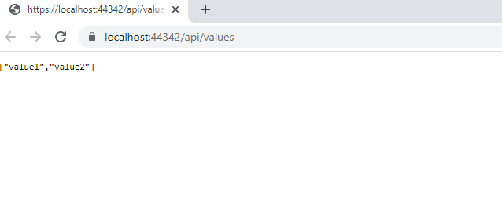
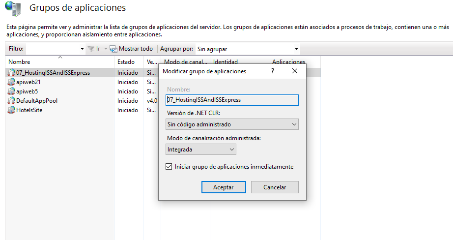
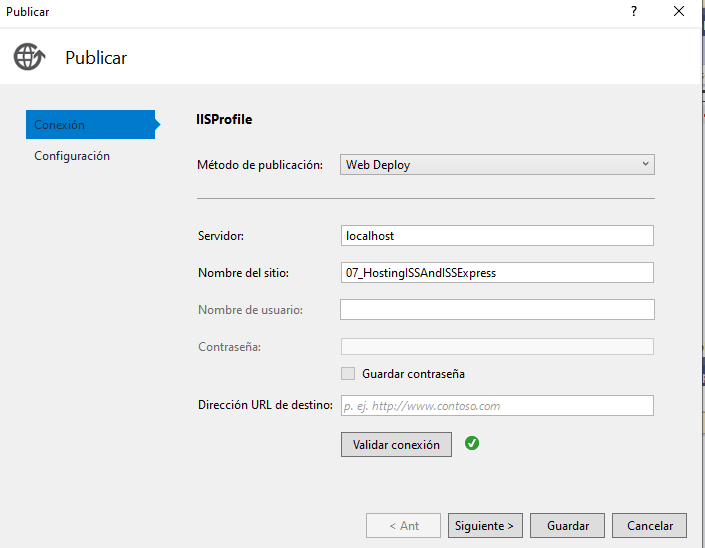
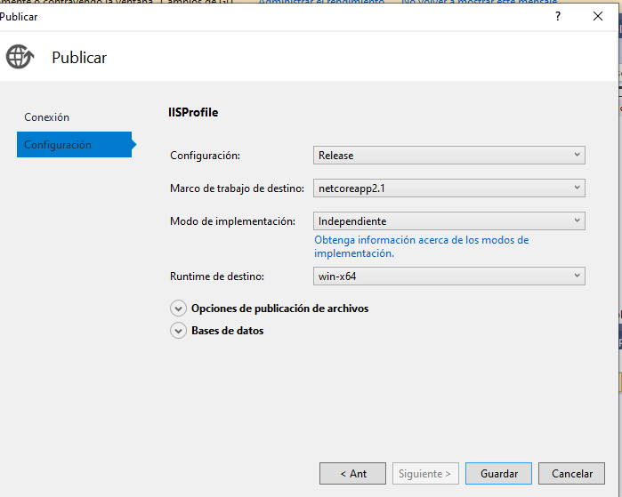
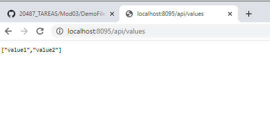

#### Demonstration: Hosting web API in IIS and IIS Express

Se trata de publicar en IIS una aplicación web api 

Los pasos a seguir 

Abrimos la solucion y ejecutamos el proyecto HostingISSAndISSExpress.Host para ver que esta funcionando correctamentamente.

Crear el Sitio y configurar el grupo de aplicaciones 

Publicar desde visual Studio

ejecutar la aplicación

