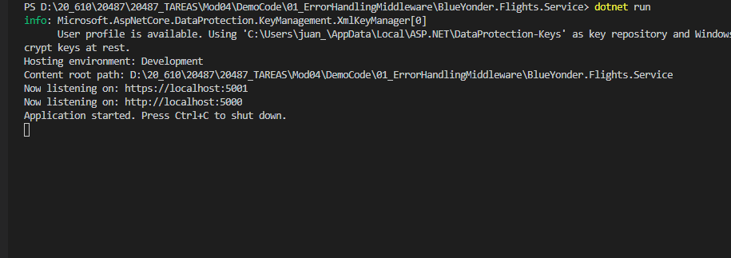

## Module 4: Extending ASP.NET Core HTTP services

### Lesson 1: The ASP.NET Core Request Pipeline

#### Demonstration: Creating a Middleware for Custom Error Handling


Abrimos la solución Mod04\DemoCode\01_ErrorHandlingMiddleware y ejecutamos un dotnet restore

Examinamos los dos proyectos:  

BlueYonder.Flights.DAL  

BlueYonder.Flights.Service  


Moficamos [BlueYonder.Flights.Service\Controllers\PassengerController.cs](BlueYonder.Flights.Service/Controllers/PassengerController.cs)


Para que devueleva una excepcion si no encuentra el pasajero.

```c#
// GET api/passenger/5
[HttpGet("{id}")]
public async Task<ActionResult<Passenger>> Get(int id)
{
	Passenger passenger = await _passengerRepository.GetPassenger(id);
	if (passenger == null)
		throw new KeyNotFoundException();
	return Ok(passenger);
}
```


Creamos  [BlueYonder.Flights.Service\Middleware\ExceptionHandlingMiddleware.cs](BlueYonder.Flights.Service/Middleware/ExceptionHandlingMiddleware.cs)

```c#
using System;
using System.Collections.Generic;
using System.Linq;
using System.Net;
using System.Threading.Tasks;
using Microsoft.AspNetCore.Builder;
using Microsoft.AspNetCore.Http;
using Newtonsoft.Json;

namespace BlueYonder.Flights.Service.Middleware
{

    public class ExceptionHandlingMiddleware
    {
        private readonly RequestDelegate _next;

        public ExceptionHandlingMiddleware(RequestDelegate next)
        {
            _next = next;
        }                                                               // Injectamos el RequestDelegate


        public async Task Invoke(HttpContext httpContext)               // Metodo Invoke
        {
            try
            {
                await _next(httpContext);
            }
            catch (Exception ex)
            {
                await HandleExceptionAsync(httpContext, ex);
            }
        }
        private Task HandleExceptionAsync(HttpContext context, Exception exception)        //HandleExceptionAsync aqui va la logica 
        {
            var code = HttpStatusCode.InternalServerError;
            if (exception is KeyNotFoundException) code = HttpStatusCode.NotFound;          //  si exception is  KeyNotFoundException el code = 404
            var result = JsonConvert.SerializeObject(new { error = exception.Message });   
            context.Response.ContentType = "application/json";
            context.Response.StatusCode = (int)code;
            return context.Response.WriteAsync(result);                                      // mando 404 en el stadusCode y en el result el json del mensaje
        }
    }

    public static class ExceptionHandlingMiddlewareExtensions
    {
        public static IApplicationBuilder UseExceptionHandlingMiddleware(this IApplicationBuilder builder)   // y con esto sobreescribo UseExceptionHandlingMiddleware
        {
            return builder.UseMiddleware<ExceptionHandlingMiddleware>();
        }
    }
}
```


Una vez Creado el Middleware vamos a utilizarlo en el [BlueYonder.Flights.Service\Startup.cs](BlueYonder.Flights.Service/Startup.cs)  


Añadimos el using BlueYonder.Flights.Service.Middleware;  

y el  app.UseExceptionHandlingMiddleware(); en el Configure  


Corremos la aplicación





y abrimos el explorer


Observa el código 404 cuando no existe el Passenger


