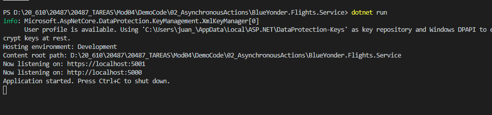
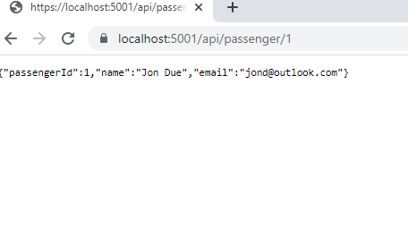
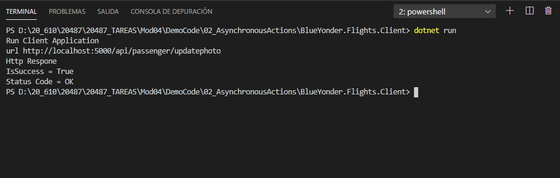
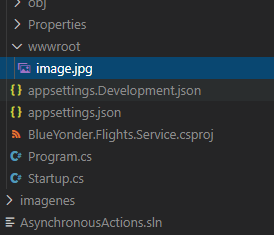

## Module 4: Extending ASP.NET Core HTTP services

### Lesson 2: Customizing Controllers and Actions

#### Demonstration: Creating Asynchronous Action


Abrimos la solución 02_AsynchronousActions y ejecutamos un dotnet restore


La aplicación es igual que la demo anterior salvo porque le hemos añadido un Client

Es decir tenemos la capa Dal  BlueYonder.Flights.DAL   
En este capa modificamos la cadena de conexion en PassengerDbContext )e mi caso que tiro del sql del VStudio2019  
```c#
 optionsBuilder.UseSqlServer(@"Server=(localDB)\.;Database=Mod4Demo1DB;Trusted_Connection=True;");
```` 
una capa servicio BlueYonder.Flights.Service  
y una capa cliente BlueYonder.Flights.Client  

Lo primero vamos a añadir la carpeta  wwwroot al proyecto BlueYonder.Flights.Service 

y añadaimos el método siguiente a [BlueYonder.Flights.Service\Controllers\PassengerController](BlueYonder.Flights.Service/Controllers/PassengerController.cs)
```c# 
[HttpPut("UpdatePhoto")]
// va a recibir un IFormFile si la longitud es > 0 y contiene una imagen la copiará en wwwroot
 public async Task<IActionResult> UpdatePhoto(IFormFile file)
 {
     if (file == null || !file.ContentType.Contains("image"))
         return BadRequest();

     if (file.Length > 0)
     {
         using (var fileStream = new FileStream(Path.Combine(_environment.WebRootPath, file.FileName), FileMode.CreateNew))
         {
             await file.CopyToAsync(fileStream);
         }
     }
     return Ok();
 }
```

Examinemos [BlueYonder.Flights.Client/Program.cs](BlueYonder.Flights.Client/Program.cs)  
```c# 
class Program
    {
        static async Task Main(string[] args)
        {
            Console.WriteLine("Run Client Application");
            var directoryPath = Environment.CurrentDirectory + @"\Image\orderedList7.png";  // craga su imagen
            string url = "http://localhost:5000/api/passenger/updatephoto";            

            using (FileStream imageFile = File.OpenRead(directoryPath))
            {
                HttpResponseMessage httpResponse = await UploadImageAsync(imageFile, url);   // llama a UploadImageAsync
                Console.WriteLine($"Http Respone");
                Console.WriteLine($"IsSuccess = {httpResponse.IsSuccessStatusCode}");
                Console.WriteLine($"Status Code = {httpResponse.StatusCode}");
            }
        }

        public static async Task<HttpResponseMessage> UploadImageAsync(Stream image,string url)  // *****
        {
            var requestContent = new MultipartFormDataContent();  
            var imageContent = new StreamContent(image);
            imageContent.Headers.ContentType =
                MediaTypeHeaderValue.Parse("image/jpeg");
            requestContent.Add(imageContent, "file", "image.jpg");              // aqui al MultipartFormDataContent().add la imagen  StreamContent(image);
            using (var client = new HttpClient())
            {
                return await client.PutAsync(url, requestContent);              // llama a un HttpClient().PutAsync(http://localhost:5000/api/passenger/updatephoto, requestContent)
            }																							
        }
    }
```

Ejecutamos el service 

  

  


pues sin detener service ejecutaremos en un nuevo terminal Client

  

  


