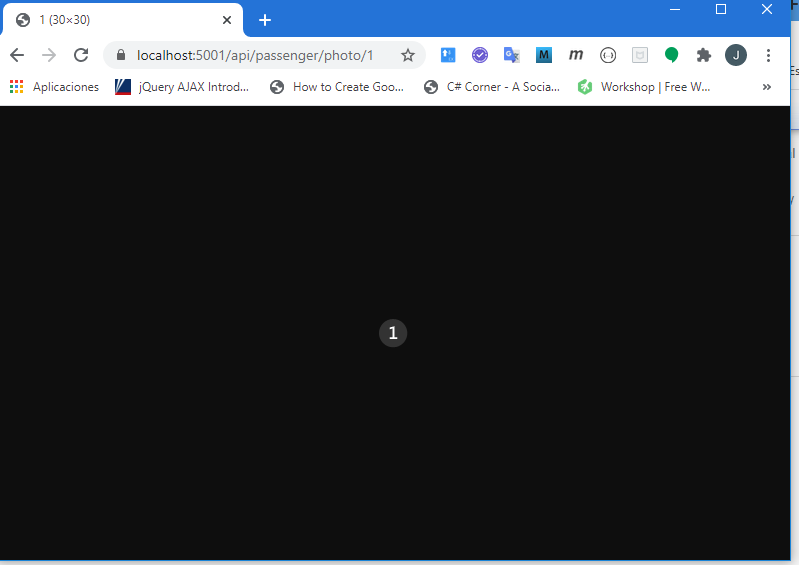
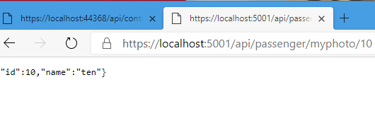

### Module 4: Extending ASP.NET Core HTTP services

#### Lesson 2: Customizing Controllers and Actions

#### Creating Custom Filters and Formatters

Esta demo nos muestra como aplicar un formater a una salida de una api web

Basta con crear una clase que derive de  OutputFormatter  
Definir en ella  SupportedMediaTypes  y sobreescribir el método WriteResponseBodyAsync  
Puedes limitar el foramter sobreescribiendo CanWriteType ó CanWriteResult 

También es posible aplicar formater de entrada.  
Debemos modificar el starup.cs ConfigureServices añadiendo  options.OutputFormatters.Insert(0, new ImageFormatter());  

[aqui hay otro ejemplo](https://github.com/dotnet/AspNetCore.Docs/tree/master/aspnetcore/web-api/advanced/custom-formatters/samples/3.x/CustomFormattersSample)


Al lio...

Abrimos con code el proyecto 03_CustomFiltersAndFormatters


examinemos app core 2.1  


[Models](CustomFiltersAndFormatters/Models/Values.cs)

```c#
 public class Value
    {
        public int Id { get; set; }
        public string Name { get; set; }
        [IgnoreDataMember]
        public string Thumbnail { get; set; }
    }
```

[Controllers\PassengerController.cs](CustomFiltersAndFormatters/Controllers/PassengerController.cs)

```c#
[Route("api/[controller]")]
    [ApiController]
    public class PassengerController : ControllerBase
    {
        private Value[] _values = new Value[] {
            new Value{Id =0, Name = "Zero", Thumbnail=@"Images\orderedlist0.png"},
            new Value{Id =1, Name = "One", Thumbnail=@"Images\orderedlist1.png"},
            ........
            new Value{Id =8, Name = "Eight", Thumbnail=@"Images\orderedlist8.png"},
            new Value{Id =9, Name = "Nine", Thumbnail=@"Images\orderedlist9.png"}
        };


        [HttpGet("Photo/{id}")]
        public Value GetPhoto(int id)
        {
            return _values[id];
        }
```


Ok


creamos [Formatters\ImageFormatter.cs](CustomFiltersAndFormatters/Formatters/ImageFormatter.cs)


```c@
using CustomFiltersAndFormatters.Models;
using Microsoft.AspNetCore.Http;
using Microsoft.AspNetCore.Mvc.Formatters;
using Microsoft.Net.Http.Headers;
using System.Threading.Tasks;

namespace CustomFiltersAndFormatters.Formatter
{
    public class ImageFormatter : OutputFormatter 
    {
        public ImageFormatter()
        {
            SupportedMediaTypes.Add(MediaTypeHeaderValue.Parse("image/png"));
        }

        public override async Task WriteResponseBodyAsync(OutputFormatterWriteContext context)
        {
            HttpResponse response = context.HttpContext.Response;
            Value value = context.Object as Value;
            if(value != null)
                await response.SendFileAsync((value).Thumbnail);
				
				//(value).Thumbnail es la ruta de un fichero PNG, lee el fichero y lo manda 
        }
    }
}
````

reemplazamos el método ConfigureServices de [Startup.cs](CustomFiltersAndFormatters/Startup.cs) por 

```c#

        public void ConfigureServices(IServiceCollection services)
        {
            services.AddMvc(options =>
            {
                options.OutputFormatters.Insert(0, new ImageFormatter());
            }).SetCompatibilityVersion(CompatibilityVersion.Version_2_1);
        }
```


vuelve al controlador y revisalo

###### Nota : El método GetPhoto devuelve la clase Value , pero el cliente obtendrá la foto a través de ImageFormatter .

ejecutamos y probamos





Pero y si no queremos que se aplique siempre el formater

bueno pues podemos sobreescribir CanWriteType ó CanWriteResult por ejemplo he modificado para que sólo escribia si el typo es Value  

```c#
 protected override bool CanWriteType(Type type)
        {
            return typeof(Value).IsAssignableFrom(type) || false;
              //  typeof(IEnumerable<Contact>).IsAssignableFrom(type);
        }
```


he añadido un método que devuelve un ValorBis

```c#
 [HttpGet("myPhoto/{id}")]
        public CustomFiltersAndFormatters.Models.Valuebis GetPhoto1(int id)
        {
            CustomFiltersAndFormatters.Models.Valuebis valor = new CustomFiltersAndFormatters.Models.Valuebis() ;
            valor.Id = _values[id].Id;
            valor.Name = _values[id].Name;
            valor.Thumbnail= _values[id].Thumbnail;
            
            return valor;
        }
```


con lo cual no lo formateará




