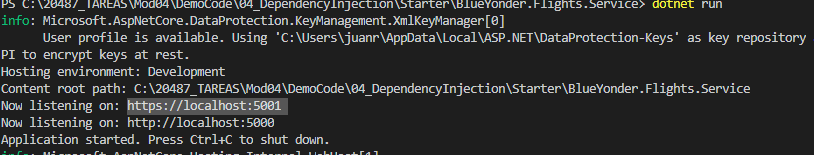
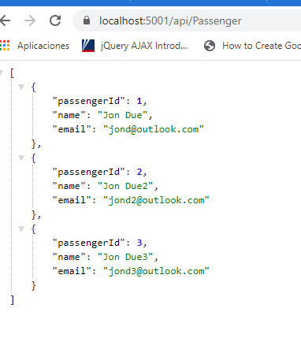

### Module 4: Extending ASP.NET Core HTTP services

#### Lesson 3: Injecting Dependencies into Controllers

##### Demonstration: Using Dependency Injection with Controllers


abrimos el proyecto Mod04\DemoCode\04_DependencyInjection con code  

hacemos un dotnet restore para restaurar las dependencias.. 

Examinamos el proyecto:

una cpa Dal con un repositorio que ejecuta un CRUD y el DbContext y un DBInitializer

un proyecto Service apiweb 2.1 con un controlador Passenger y un CRUD a traves del repositorio 


Tenemos que implementar la injeccion de depencia por lo que nos creamos en la capa dal
 la interfaz [IPassengerRepository](Starter/BlueYonder.Flights.DAL/Repository/IPassengerRepository.cs)


indicamos [PassengerRepository](Starter/BlueYonder.Flights.DAL/Repository/PassengerRepository.cs) a que implementa la interfaz 


Ahora en el método ConfigureServices  del  [Startup.cs](Starter/BlueYonder.Flights.Service/Startup.cs) registramos el repositorio con

```c#
services.AddTransient<IPassengerRepository, PassengerRepository>();
```

y ya estaría listo para injectarlo en el controlador [PassengerController.cs](Starter/BlueYonder.Flights.Service/Controllers/PassengerController.cs)


modificando el código siguiente 

```c#
/*  private readonly PassengerRepository _passengerRepository;

        public PassengerController()
        {
            _passengerRepository = new PassengerRepository();
        }
        */
```

por 

```c#
        private readonly IPassengerRepository _passengerRepository;
        public PassengerController(IPassengerRepository passengerRepository)
        {
            _passengerRepository = passengerRepository;
        }
```

probamos la aplicación






