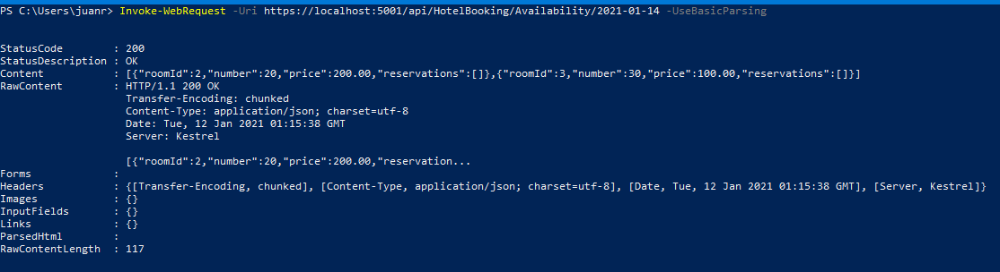
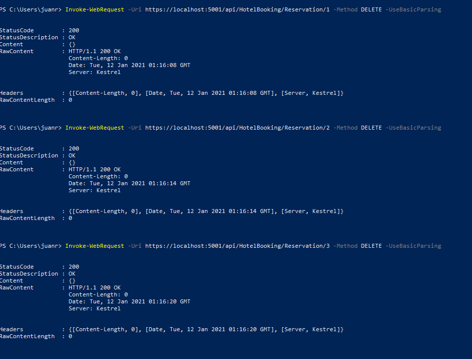
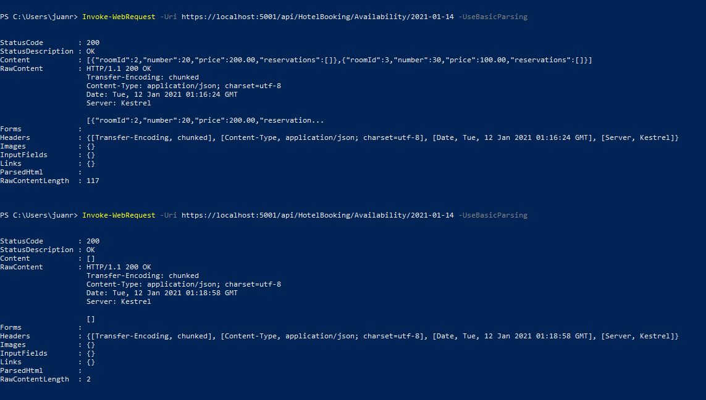
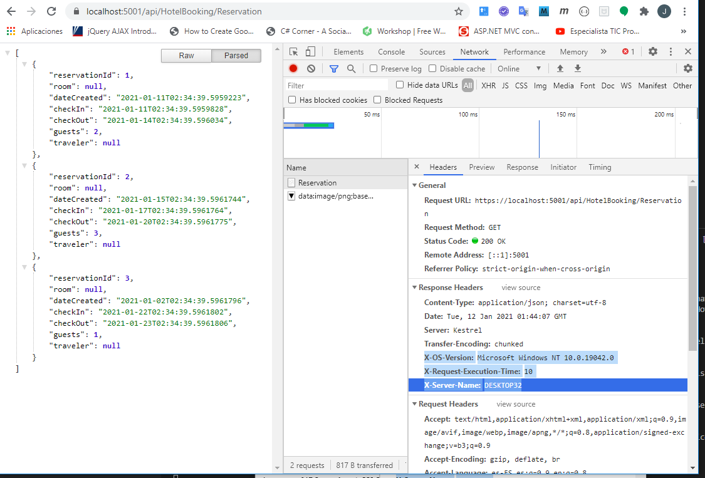

## Module 4: Extending ASP.NET Core HTTP Services

### Lab: Customizing the ASP.NET Core Pipeline


#### Exercise 1: Use Dependency Injection to Get a Repository Object

Hacemos un dotnet restore  Mod04\LabFiles\Lab1\Starter\BlueYonder.Hotels y lo abirmos con CODE.

Es el mismo tipo de proyecto que en la demo4 una capa dal y una web api...

No me entreteneé mucho en este ejercicio ya que lo hemos hecho 1000
##### Task 1: Create an interface for the repository
creamos [BlueYonder.Hotels.DAL\Repository\IHotelBookingRepository.cs](BlueYonder.Hotels/BlueYonder.Hotels.DAL/Repository/IHotelBookingRepository.cs) (es sencilla porque ya tenemos la clase).

##### Task 2: Implement the interface on the repository  
indicamos que [HotelBookingRepository.cs](BlueYonder.Hotels/BlueYonder.Hotels.DAL/Repository/HotelBookingRepository.cs) implementa la interfaz

##### Task 3: Register the repository object in the ASP.NET Core Dependency Injection mechanism  
registramos el repositorio en  [BlueYonderHotels.Service\Startup.cs](BlueYonder.Hotels/BlueYonderHotels.Service/Startup.cs)

##### Task 4: Change the controller’s constructor to request an injected repository
injectamos la dependencia en [BlueYonderHotels.Service\Controllers\HotelBookingController.cs](BlueYonder.Hotels/BlueYonderHotels.Service/Controllers/HotelBookingController.cs)

----

#### Exercise 2: Create a Cache Filter

##### Task 1: Create an action filter for cache headers
Creamos el archivo BlueYonderHotels.Service\Attributes\CacheAttribute.cs](BlueYonder.Hotels/BlueYonderHotels.Service/Attributes/CacheAttribute.cs)

```c#
	using Microsoft.AspNetCore.Mvc;
	using Microsoft.AspNetCore.Mvc.Filters;
	using Microsoft.Extensions.Primitives;
	using System;
	using System.Collections.Generic;
	using System.Linq;
	using System.Threading.Tasks;

	namespace BlueYonderHotels.Service.Attribute
	{
	public class CacheAttribute : ActionFilterAttribute
	{
		private string _headerMessage { get; set; }
		private TimeSpan _durationTime;
		private const int _defulatDuration = 60;
		private Dictionary<string, (DateTime, IActionResult)> _cache = new Dictionary<string, (DateTime, IActionResult)>();

		public CacheAttribute(int duration = _defulatDuration)
		{
			_durationTime = new TimeSpan(0, 0, duration);
		}
		public CacheAttribute(string message)
		{
			_durationTime = new TimeSpan(0, 0, _defulatDuration);
			_headerMessage = message;
		}

		private bool CacheValid(FilterContext context)
		{
			StringValues xCacheHeader = context.HttpContext.Request.Headers[_headerMessage];
			if (xCacheHeader == "false" || xCacheHeader.Count == 0)
			{
				if (_cache.TryGetValue(context.HttpContext.Request.Path, out (DateTime, IActionResult) cacheValue))
				{
					if (DateTime.Now - cacheValue.Item1 < _durationTime)
					{
						return true;
					}
				}
			}
			return false;
		}
		public override void OnActionExecuting(ActionExecutingContext context)
		{
			if (CacheValid(context))
			{
				context.Result = _cache[context.HttpContext.Request.Path].Item2;
				return;
			}
			base.OnActionExecuting(context);
		}
		public override void OnResultExecuted(ResultExecutedContext context)
		{
			if (!CacheValid(context))
				_cache[context.HttpContext.Request.Path] = (DateTime.Now, context.Result);
			base.OnResultExecuted(context);
		}
	}
}
```` 

##### Task 2: Add the cache filter to several actions

Decoramos con [Cache("X-No-Cache")] el método en el controlador

```c#
[HttpGet("Availability/{date}")]
[Cache("X-No-Cache")]
	public IEnumerable<Room> GetAvailability(DateTime date)
	{
		return _hotelBookingRepository.GetAvaliabileByDate(date);
	}
```
##### Task 3: Test cacheable and non-cacheable actions from a browser

Para probarlo vamos a ejecutar desde PowerShell 
```bash
Invoke-WebRequest -Uri https://localhost:5001/api/HotelBooking/Availability/2021-01-14 -UseBasicParsing
```


eliminamos las tres reservas existententes 
```bash
Invoke-WebRequest -Uri https://localhost:5001/api/HotelBooking/Reservation/1 -Method DELETE -UseBasicParsing
Invoke-WebRequest -Uri https://localhost:5001/api/HotelBooking/Reservation/2 -Method DELETE -UseBasicParsing
Invoke-WebRequest -Uri https://localhost:5001/api/HotelBooking/Reservation/3 -Method DELETE -UseBasicParsing
```   


y vemos que si volvemeos a ejecutar AAvailability/2021-01-14  el resultado sigue igual hasta que pasan 60 sgundos




#### Exercise 3: Create a Debugging Middleware
Task 1: Create a middleware class to calculate execution time
Task 2: Write server and debug information to response headers
Task 3: Create the IApplicationBuilder helper class

creamos e implementamos [BlueYonderHotels.Service\Middleware\ExecutionTimeMiddleware.cs](BlueYonder.Hotels/BlueYonderHotels.Service/Middleware/ExecutionTimeMiddleware.cs)

```c#
using Microsoft.AspNetCore.Builder;
using Microsoft.AspNetCore.Http;
using System;
using System.Collections.Generic;
using System.Diagnostics;
using System.Linq;
using System.Threading.Tasks;

namespace BlueYonderHotels.Service.Middleware
{

    public static class ExecutionTimeMiddleware
    {


        private static async Task AddResponeHeaders(HttpContext context, Func<Task> next)
        {
            context.Response.Headers.Add("X-Server-Name", Environment.MachineName);
            context.Response.Headers.Add("X-OS-Version", Environment.OSVersion.VersionString);
            Stopwatch stopwatch = new Stopwatch();
            stopwatch.Start();

            context.Response.OnStarting(state =>
            {
                var httpContext = (HttpContext)state;
                stopwatch.Stop();
                httpContext.Response.Headers.Add("X-Request-Execution-Time", stopwatch.ElapsedMilliseconds.ToString());
                return Task.CompletedTask;
            }, context);


            await next();
        }

        public static IApplicationBuilder UseExecutionTimeMiddleware(this IApplicationBuilder app)
        {
            app.Use(AddResponeHeaders);
            return app;
        }
    }
}
```


Task 4: Register the middleware to the ASP.NET Core pipeline

en [BlueYonderHotels.Service\Startup.cs](BlueYonder.Hotels/BlueYonderHotels.Service/Startup.cs)

```c#

..........
using BlueYonderHotels.Service.Middleware;
...........

public void Configure(IApplicationBuilder app, IHostingEnvironment env)
        {
            if (env.IsDevelopment())
            {
                app.UseDeveloperExceptionPage();
            }
            else
            {
                app.UseHsts();
            }
            app.UseExecutionTimeMiddleware();
            app.UseHttpsRedirection();
            app.UseMvc();
        }
```

Task 5: Test the new middleware from a browser





