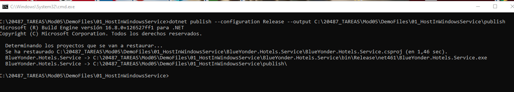
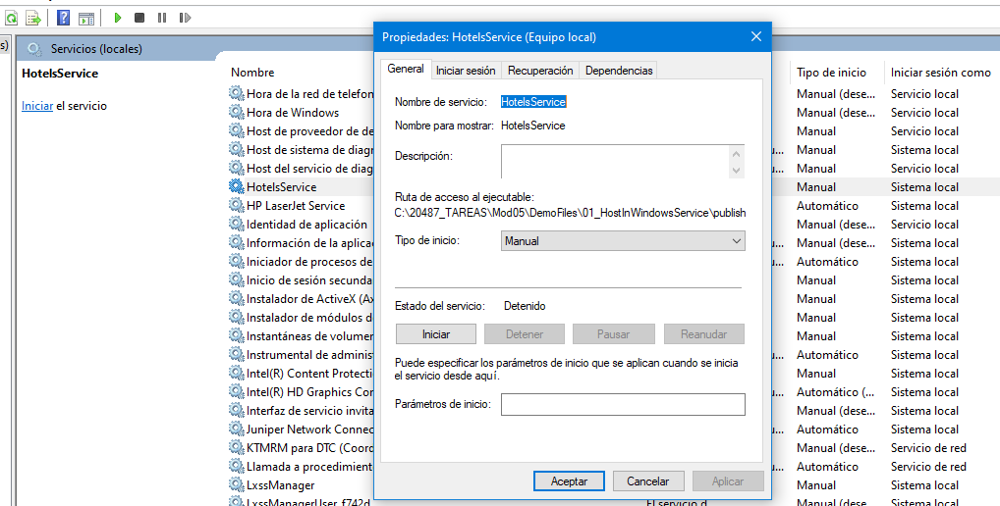
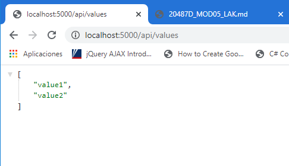
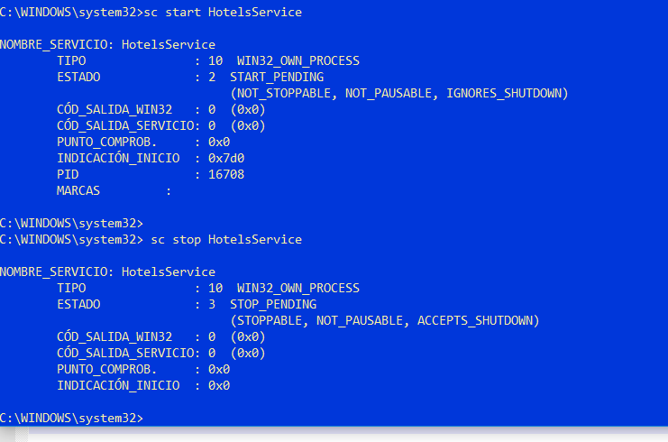

#### Module 5: Hosting Services On-Premises and in Azure

#### Lesson 1: Hosting Services On-Premises

##### Demonstration: Hosting Services On-Premises by using Windows Services with Kestrel (RunAsService)


Publicamos la solucion con el comando dotnet publish


```bash

dotnet publish --configuration Release --output  C:\20487_TAREAS\Mod05\DemoFiles\01_HostInWindowsService\publish

```




arancamos un cmd con opcion de administrador y creamos el servicio

```bash

 sc create HotelsService binPath= C:\20487_TAREAS\Mod05\DemoFiles\01_HostInWindowsService\publish\BlueYonder.Hotels.Service.exe

 ```
 
 


Podemos arrancarlo desde consola o desde cdm

 
 
 
 Para arrancarlo desde cmd ejecutar 
 
 ```bash
 
 sc start HotelsService
 
```


Ahora ya estaría ejecutandos y podemos hacer uso de él

 
 
 
  Para pararlo desde cmd ejecutar 
 
 ```bash
 
 sc stop HotelsService
 
```
 
 
  
  
  
  
  Por último para eliminarlo basta con sc delete HotelsService
 