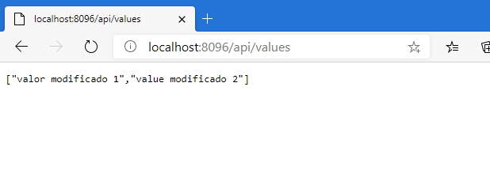

#### Module 5: Hosting Services On-Premises and in Azure

#### Lesson 1: Hosting Services On-Premises

#####  Demonstration: Hosting ASP.NET Core Services in IIS

En IIS creamos un sitio web con la configuración siguiente

abrimos la solucion con Visual Studio, comprobamos que funciona (es una apiweb2.1)

Procedemos a publicar en un IIS web deploy

una vez publicado ya tenemos nuestra api funcionando

si modifcamos el programa basta con volver a publicar para que los cambios 

