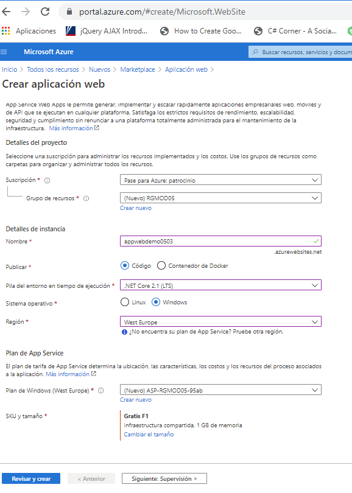
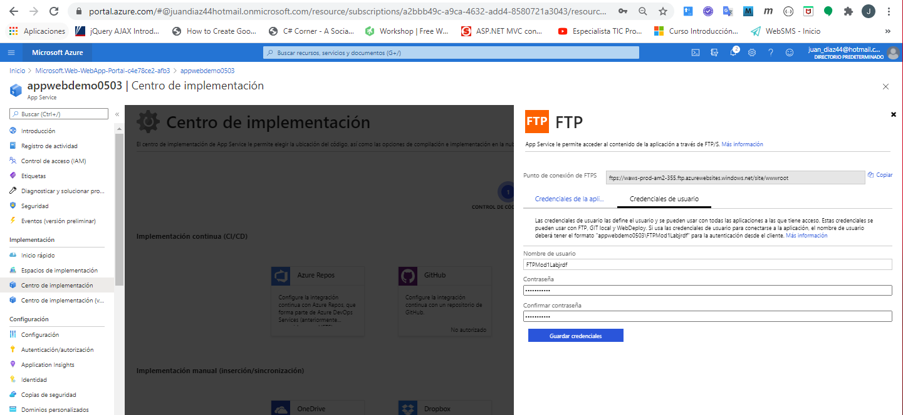
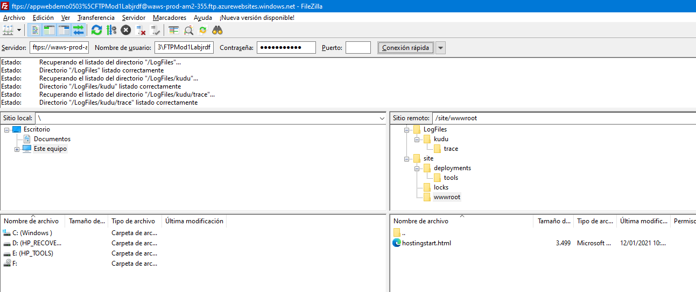
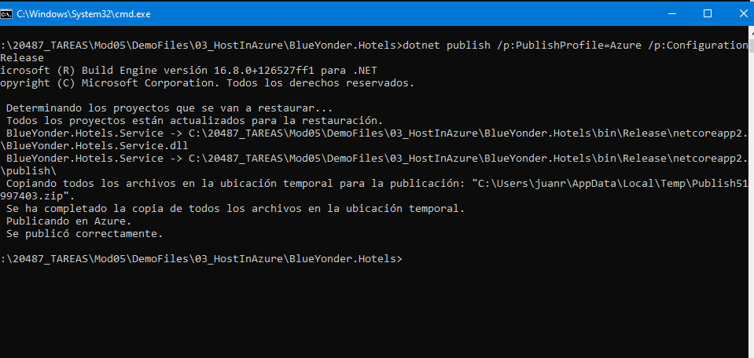
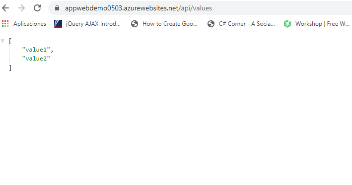

#### Module 5: Hosting Services On-Premises and in Azure

#### Lesson 2: Hosting Services in Web Apps Feature of Azure App Service

#####  Demonstration: Hosting ASP.NET Core Web APIs in Web Apps


creamos en Azure una aplicación web




congiguramos el acceso a la implementación por ftp



como puedes ver el acceso por ftps funciona




desde un cmd creamos una web api

```bash

dotnet new webapi --name BlueYonder.Hotels.Service --framework netcoreapp2.1 --output "C:\20487_TAREAS\Mod05\DemoFiles\03_HostInAzure\BlueYonder.Hotels"

```


creamos el fichero [Properties/PublishProfiles/Azure.pubxml](BlueYonder.Hotels/Properties/PublishProfiles/Azure.pubxml)

```xml

<Project>
    <PropertyGroup>
    <PublishProtocol>Kudu</PublishProtocol>
    <PublishSiteName>appwebdemo0503</PublishSiteName>
    <UserName>FTPMod1Labjrdf</UserName>
    <Password>Pa$$word123</Password>
    </PropertyGroup>
</Project>

```





y probamos


