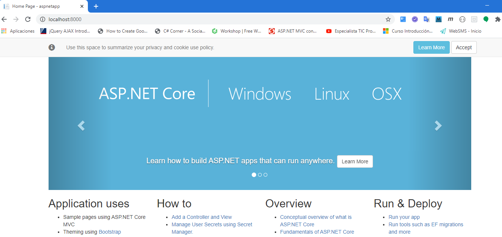
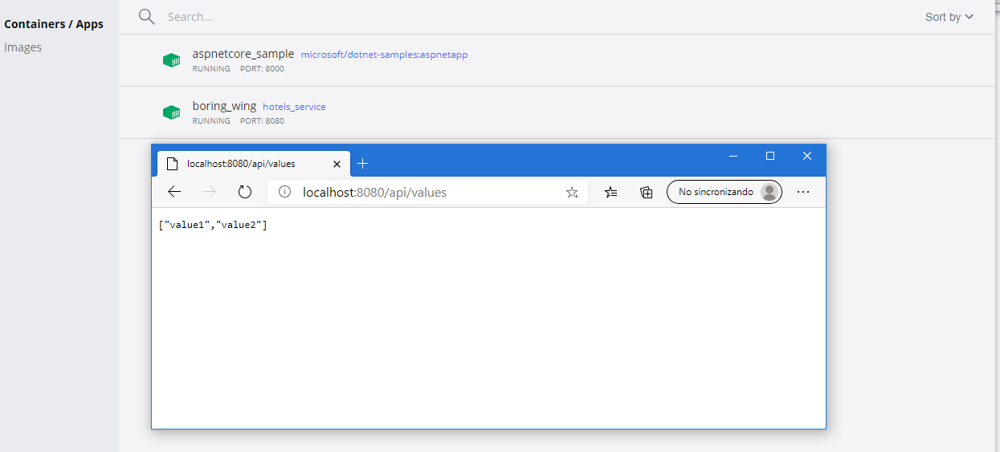

#### Module 5: Hosting Services On-Premises and in Azure

#### Lesson 3: Packaging Services in Containers

#####  Demonstration: Creating an empty ASP.NET Core Docker container


Para crear un  contenedor ASP.NET Core predeterminado que escucha en un puerto 8080 basta con ejecutar

```
docker run -it --rm -p 8000:80 --name aspnetcore_sample microsoft/dotnet-samples:aspnetapp
````





#### Demonstration: Publishing into a Container


creamos una apiweb 2.1 desde la linea de comandos y lo abrimos con code

```

dotnet new webapi --framework netcoreapp2.1 --name BlueYonder.Hotels.Service --output C:\20487_TAREAS\Mod05\DemoFiles\04_Host_In_Docker\Host_In_Docker

````


creamos el archivo [Host_In_Docker\DockerFile](Host_In_Docker\DockerFile) con las instrucciones de publicacion Docker

```c#
    FROM microsoft/dotnet:2.1-aspnetcore-runtime AS base
    WORKDIR /app

    EXPOSE 55419
    EXPOSE 44398

    FROM microsoft/dotnet:2.1-sdk AS build
    WORKDIR /src
    COPY Host_In_Docker/BlueYonder.Hotels.Service.csproj Host_In_Docker/
    RUN dotnet restore Host_In_Docker/BlueYonder.Hotels.Service.csproj
    COPY . .
    WORKDIR /src/Host_In_Docker
    RUN dotnet build BlueYonder.Hotels.Service.csproj -c Release -o /app

    FROM build AS publish
    RUN dotnet publish BlueYonder.Hotels.Service.csproj -c Release -o /app

    FROM base AS final
    WORKDIR /app
    COPY --from=publish /app .
    ENTRYPOINT ["dotnet", "BlueYonder.Hotels.Service.dll"]
```

ejecutamos docker build -t hotels_service -f Host_In_Docker\Dockerfile 

####### Ojo CASESENSITIVE en Host_In_Docker\Dockerfile 


ejecutamos docker run --rm -it -p 8080:80 hotels_service




nos logamos en dock hub con docker login


lo etiquetamos con nuestro nombredocker docker tag hotels_service juandiaz44/hotels_service


y lo publicamos docker push juandiaz44/hotels_service


y lo podemos ehecutar con docker run -p 4000:80 juandiaz44/hotels_service


como la tenemos en dockerhub si no la tuvieramos en local nos la descarga


