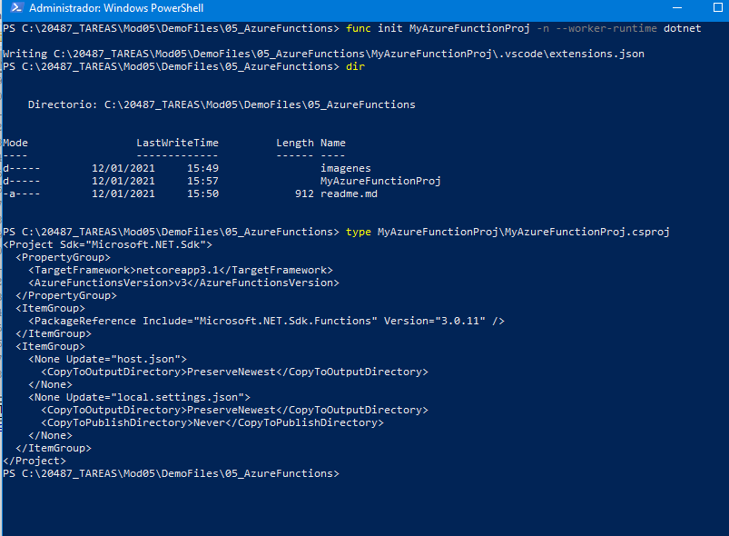

## Module 5: Hosting Services On-Premises and in Azure

### Lesson 4: Implementing Serverless Services

#### Demonstration: HTTP-triggered Azure Function

en azure nos creamos una app function

con la siguiente configuración

una vez creada la app funcion (que es un contenedor de funciones) le agregamos una nueva funcion plantilla HTTPtigger

y ya estaría creada

Podemos obtener su url

y probarla

https://aapfuncion0505.azurewebsites.net/api/HttpTrigger1?code=vP1mgB8LYYgwBsXyxe8Akg8a1YQwvlrC/maAmoRtVDwDvmt1M8AUDw==&name=juan

----

####  Demostración: desarrollo, prueba y publicación de una función de Azure desde la CLI

creamos un nuevo app function

ahora vamos a utilizar las azure functions

https://www.npmjs.com/package/azure-functions-core-tools

ejecutamos func init MyAzureFunctionProj -n --worker-runtime dotnet para crear el proyecto

con func new --language C# --template "HttpTrigger" --name MyAzureFunc creamos una nueva funcion

nos crea una funcion similar a la creada en azure functions

Para ejecutarla en local ejecutamos func host start --build

y tenemos una salida similar a la que teniamos en azure functions pero en local.

Hemos creado una funcion en local hemos visto que funciona....Ahora vamos a desplegar en azure, en este caso con AZURE CLI

