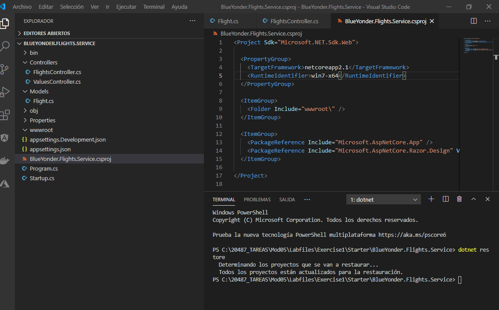
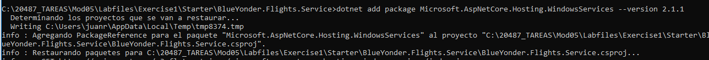
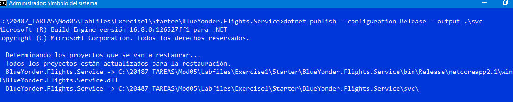
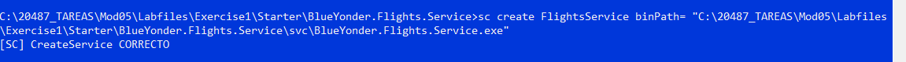
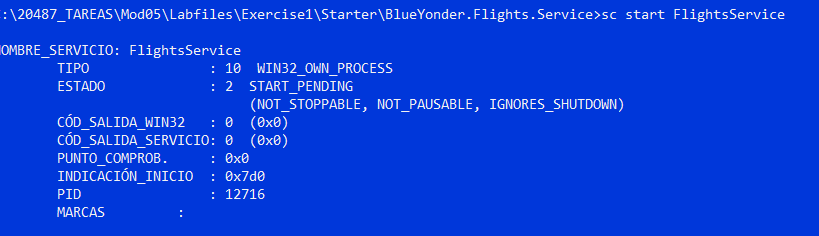
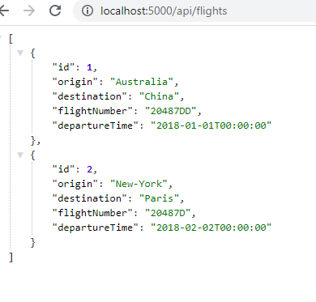
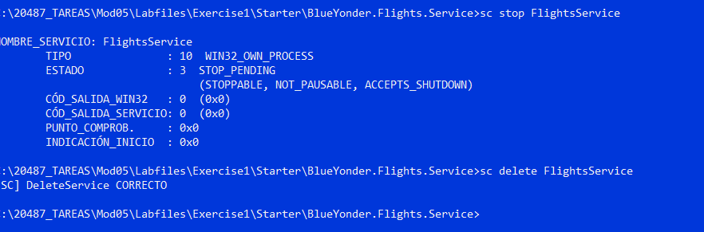

## Module 5: Hosting Services On-Premises and in Azure


----
Laboratorio 1 Lab: Host an ASP.NET Core service in a Windows Service

Se trata de ejecutar una web api netcore2.1 como servicio

1.- Modiciamos el Program
```c#
using Microsoft.AspNetCore.Hosting.WindowsServices; // Kestrel RunAsService'

public static void Main(string[] args)
	{
	   // CreateWebHostBuilder(args).Build().Run();  //Kestrel RunAsService
	   CreateWebHostBuilder(args).Build().RunAsService(); // Kestrel RunAsService'
}
```
2.-  ejecutar las siguientes ordenes desde un cmd administrador
```bash
	publicar con dotnet new webapi --name [nombreapp] --output [path] -f [framework]
    registrar sc create [nombreservicio]  binPath= [path\nombreapp.exe]
	start sc strat [nombreservicio] 
	stop sc stop [nombreservicio] 
	delete sc delete [nombreservicio] 
```

----


### Lab: Host an ASP.NET Core service in a Windows Service

#### Exercise 1: Creating an ASP.NET Core Application


creamos una web api netcoreapp2.1

dotnet new webapi --name BlueYonder.Flights.Service --output C:\20487_TAREAS\Mod05\Labfiles\Exercise1\Starter\BlueYonder.Flights.Service -f netcoreapp2.1

añadimos la carpeta [Models\Flight.cs](Starter/BlueYonder.Flights.Service/Models/Flight.cs)
y [Controllers/FlightsController.cs](Starter/BlueYonder.Flights.Service/Controllers/FlightsController.cs) desde Assets 

y modificamos [BlueYonder.Flights.Service.csproj](Starter/BlueYonder.Flights.Service/BlueYonder.Flights.Service.csproj)



instalamos  Microsoft.AspNetCore.Hosting.WindowsServices NuGet package

dotnet add package Microsoft.AspNetCore.Hosting.WindowsServices --version 2.1.1




Modify the Main method to use Kestrel RunAsService hosting

modificamos [Program.cs](Starter/BlueYonder.Flights.Service/Program.cs)

```c#
...................
using Microsoft.AspNetCore.Hosting.WindowsServices; // Kestrel RunAsService'

namespace BlueYonder.Flights.Service
{
    public class Program
    {
        public static void Main(string[] args)
        {
           // CreateWebHostBuilder(args).Build().Run();  //Kestrel RunAsService
           CreateWebHostBuilder(args).Build().RunAsService(); // Kestrel RunAsService'
        }
		...................
```		


Publicamos _  dotnet publish --configuration Release --output .\svc
 
 
 
Creamos el servicio sc create FlightsService binPath= "C:\20487_TAREAS\Mod05\Labfiles\Exercise1\Starter\BlueYonder.Flights.Service\svc\BlueYonder.Flights.Service.exe"

 

Arrancamos sc start FlightsService

 
 
 Probamos la app
 
  
  
  
  Detenemos el servicio y lo borramos
  
  sc stop FlightsService  
  sc delete FlightsService
  

  
  
  
  