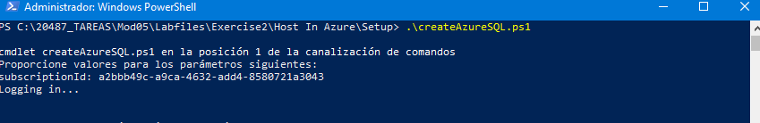
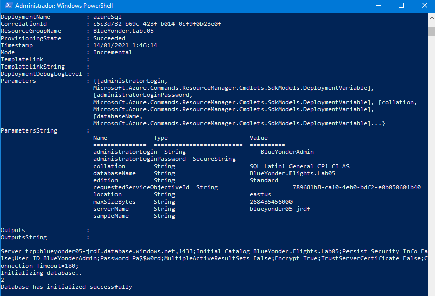
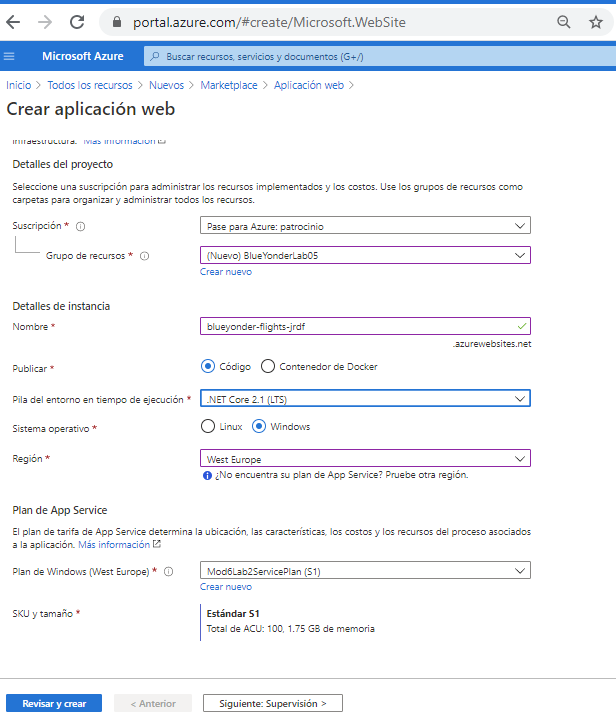
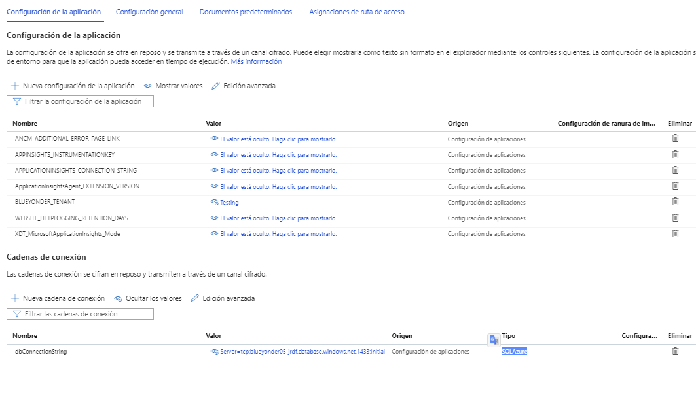
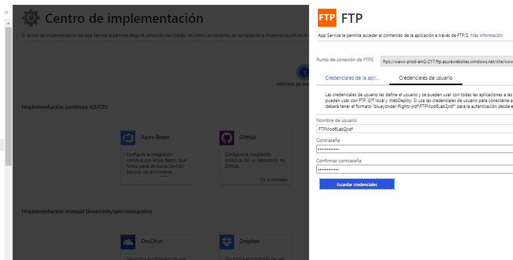
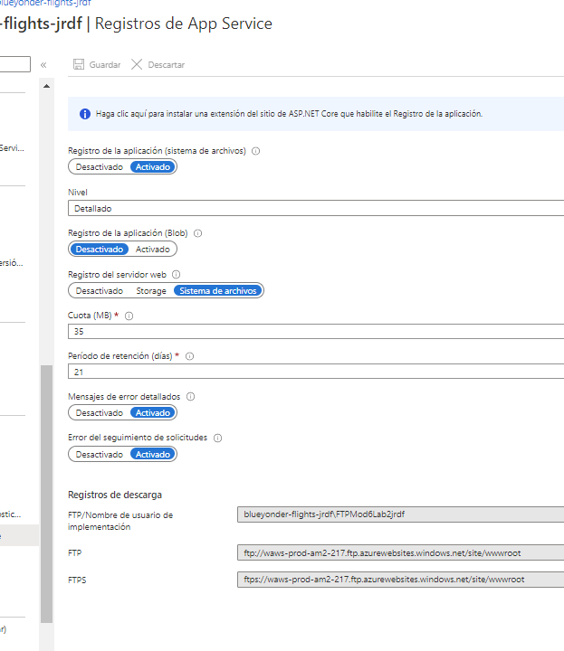
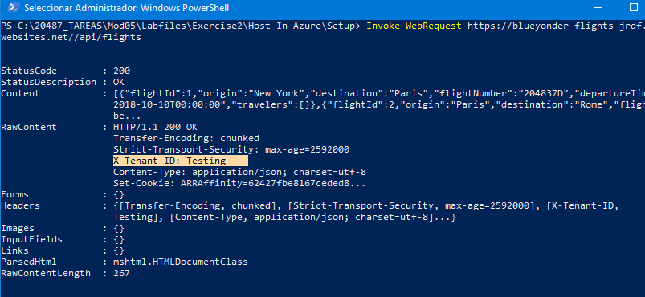
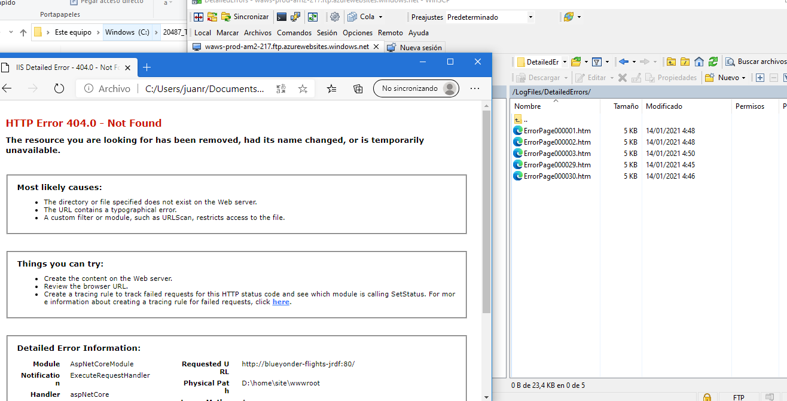

## Module 5: Hosting Services On-Premises and in Azure

### Lab: Host an ASP.NET Core Web API in an Azure Web App

----
Laboratorio 2 Lab: Host an ASP.NET Core Web API in an Azure Web App

1.- creamos un recurso sql mediante un programa Powershell [Host In Azure/Setup](Host In Azure/Setup)

2.- en la appweb tenemos varias cosas:

. deploy a traves de ftp (de memoria lo hacemos ya)

. configuramos la app para tener variales de entorno y cadena de conexion (ojo a como accedemos a ella a través del programa)

. configuramos los los de supervisión y accedemos a ellos a través de ftp

----

crearemos la base de datos a traves de Power Shell 5 (nota deberemos tener instalado Install-Module azurerm -AllowClobber -MinimumVersion 5.4.)

creamos una web api F1 con la siguiente configuración

En configuración añadimos una variable de entorno y la cadena de conexión

configuramos las credianles de usuario ftp en cel centro de implementación

  
  
 y configuramos en supervision el registro de la actividad 
 
 
 
 
 Ahora vamos a nuestra aplicación y la publicamos con un dotnet publish /p:PublishProfile=Azure /p:Configuration=Release  
 aunque antes verificamos Properties/PublishProfiles/Azure.pubxml
 
 
 y la probamos
 
   Invoke-WebRequest https://blueyonder-flights-jrdf.azurewebsites.net//api/flights
   
   
    
  
  
  Por último si probamos una página que no exista 
  
   Invoke-WebRequest https://blueyonder-flights-jrdf.azurewebsites.net
   
   Podemos ver el error en ftp
   
    
  
  