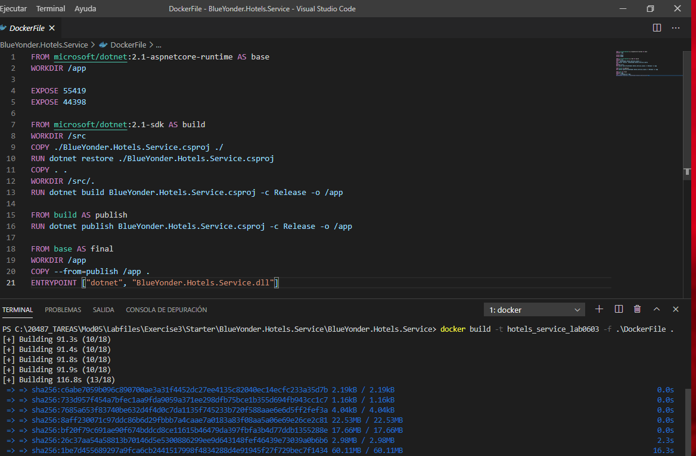
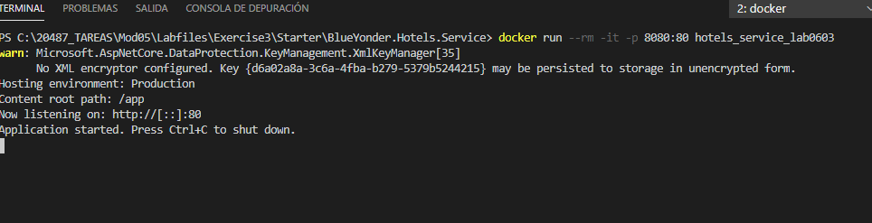
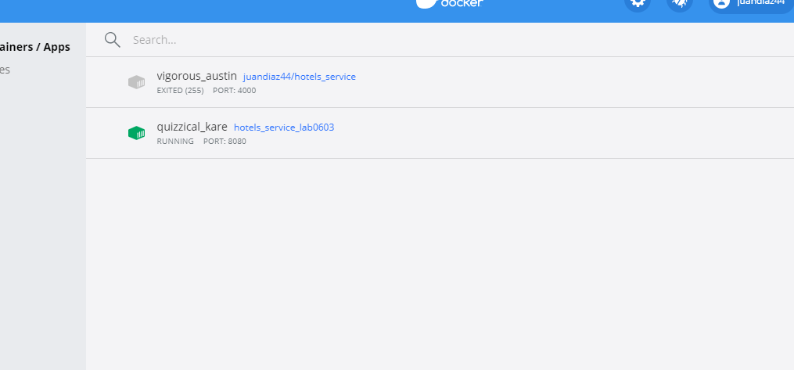
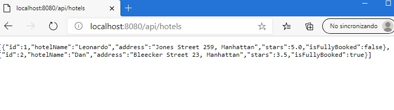
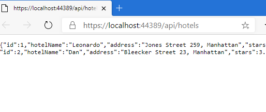
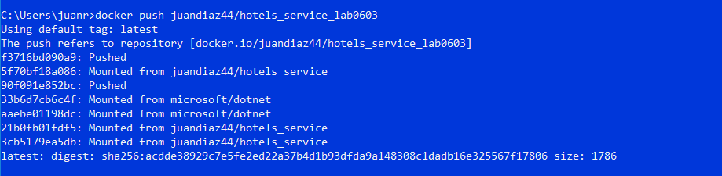
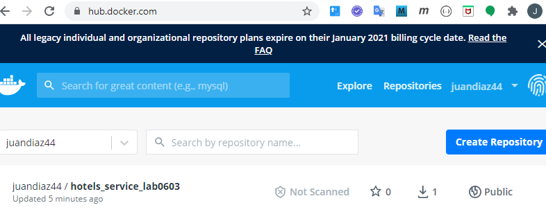
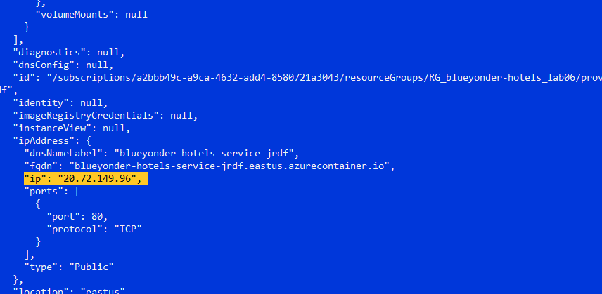
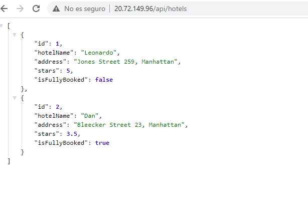

## Module 5: Hosting Services On-Premises and in Azure


### Lab: Host an ASP.NET Core service in Azure Container Instances


---

1. Construimos y Publicamos en Docker a través de un DockerFile  (imagen) docker build -t [ nombre ] -f .\DockerFile .

2. Ejecutamos (se crea el conenedor) docker run --rm -it -p 8080:80 [ nombre ]

3. Publicamos docker login , docker tag [ nombre ] [ userdocker/nombre ] , docker push [ userdocker/nombre ]

4. creamos un contenedor a través de azure 

	```
	az group create -l eastus -n RG_blueyonder-hotels_lab06 --subscription "Pase para Azure: patrocinio"

	 az container create --resource-group RG_blueyonder-hotels_lab06 --name hotels-container-jrdf --image juandiaz44/hotels_service_lab0603 --dns-name-label blueyonder-hotels-service-jrdf --ports 80
	```

5. Para abrir con  az container list vemos la Ip  y navegamos a ella


---


Construimos y Publicamos en Docker a través de un DockerFile 

docker build -t hotels_service_lab0603 -f .\DockerFile .



Ejecutamos

docker run --rm -it -p 8080:80 hotels_service








abrimos con VS 2019 y verificamos que funciona




lo publicamos en docker hub

docker login


docker tag hotels_service_lab0603 juandiaz44/hotels_service_lab0603


docker push juandiaz44/hotels_service_lab0603





Publicamos en Azure a traves de azure client

```
az login

az group create -l eastus -n RG_blueyonder-hotels_lab06 --subscription "Pase para Azure: patrocinio"

az container create --resource-group RG_blueyonder-hotels_lab06 --name hotels-container-jrdf --image juandiaz44/hotels_service_lab0603 --dns-name-label blueyonder-hotels-service-jrdf --ports 80 --subscription "Pase para Azure: patrocinio"
 
``` 
 
 la listamos
 ``` 
 az container list --subscription "Pase para Azure: patrocinio"
``` 




y a volar




