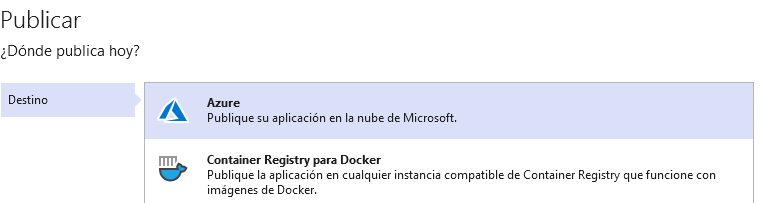

## Module 6: Deploying and Managing Services

### Lesson 1: Web Deployment with Microsoft Visual Studio

#### Demonstration: Deploying a Web Application with Visual Studio

Abrimos VS 2019 como Administrador, creamos una nueva aplicacion web api core 2.1 

creamos una Aplicacón web en Azure

con la siguiente configuración

Volvemos a Vs studio y publicamos

y voala!

