## Module 6: Deploying and Managing Services

### Lesson 2: Web Deployment on Linux

### Demonstration: Deploying an ASP.NET Core Web Service with Nginx

Cramos una maquina ubuntu

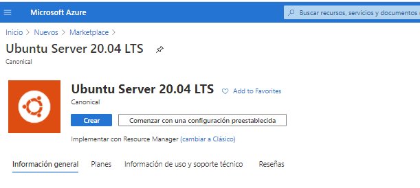

con la siguiente configuración

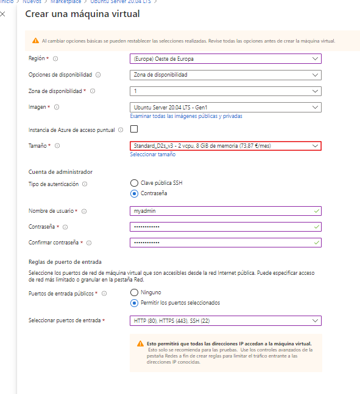


En Code abrimos el proyecto C:\20487_TAREAS\Mod06\DemoFiles\demo0602\Demo2Project

añadimos el RuntimeIdentifiers en el archivo [Demo2Project.csproj](Demo2Project/Demo2Project.csproj) y publicampos com dotnet publish -c release -r ubuntu.20.04-x64  

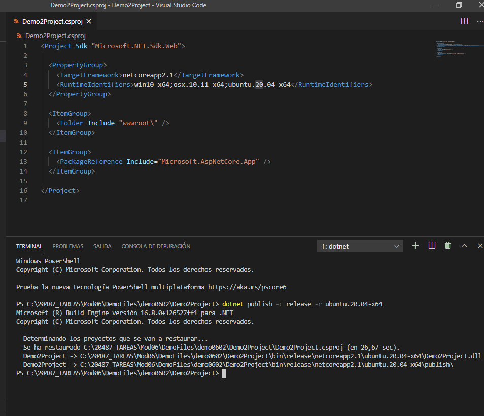


Nos conectamos a la maquina virutal

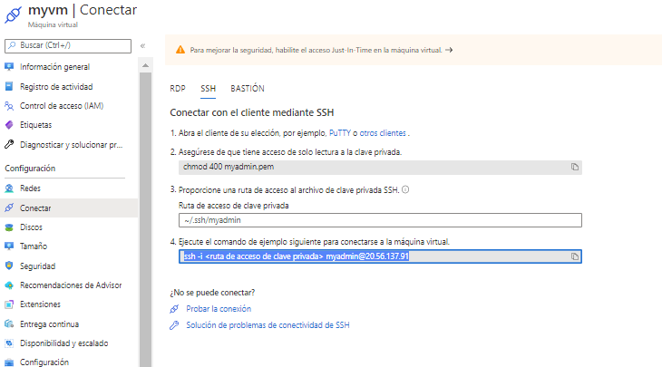

```bash
ssh myadmin@20.56.137.91
```

una vez conectados

creamos el directorio /var/demo

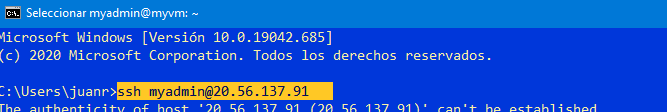

y publicamos 

scp -r .\ubuntu.20.04-x64\ ssh myadmin@20.56.137.91:/var/demo desde (C:\20487_TAREAS\Mod06\DemoFiles\demo0602\Demo2Project\bin\release\netcoreapp2.1)

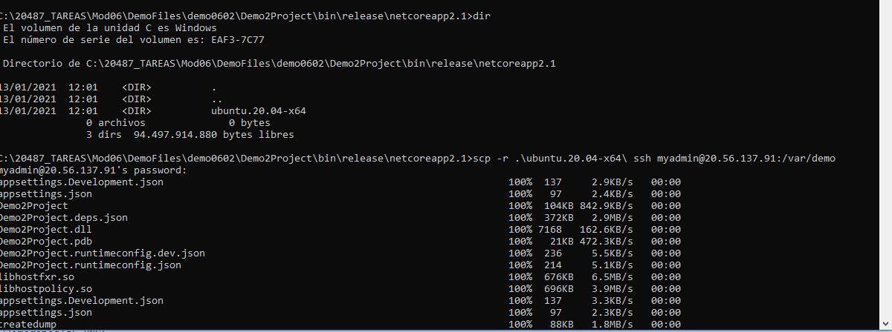


En Ubuntu instalamos un nginx
```bash
sudo -s
nginx=stable
add-apt-repository ppa:nginx/$nginx
apt-get update
apt-get install nginx
```

arrancamos el nginx
```
sudo service nginx start
```

verificamos http://20.56.137.91/index.nginx-debian.html

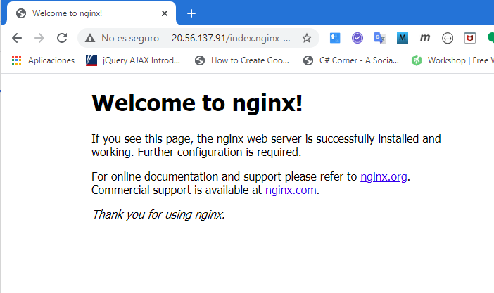

Vamos a configurar nginx para abrir nuestra aplicación

editamos el archivo default
```bash
cd /etc/nginx/sites-available/
vi default
```

y  modificamos location
````
location / {
                # First attempt to serve request as file, then
                # as directory, then fall back to displaying a 404.
                # try_files $uri $uri/ =404;
                proxy_pass         http://localhost:5000;
                proxy_http_version 1.1;
                proxy_set_header   Upgrade $http_upgrade;
                proxy_set_header   Connection keep-alive;
                proxy_set_header   Host $host;
                proxy_cache_bypass $http_upgrade;
                proxy_set_header   X-Forwarded-For $proxy_add_x_forwarded_for;
                proxy_set_header   X-Forwarded-Proto $scheme;
        }
````
recuerda los comandos de vi (esc i, esc x, esc q! (para salir sin modicar))

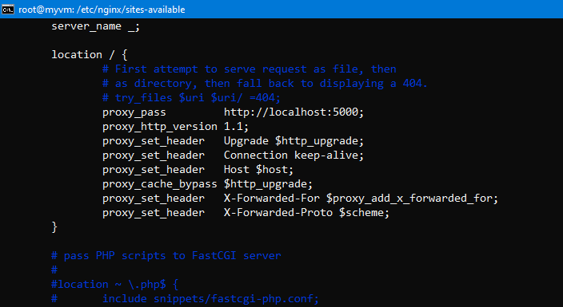


probamos configuracion y actualizamos en su caso

sudo nginx -t
sudo nginx -s reload

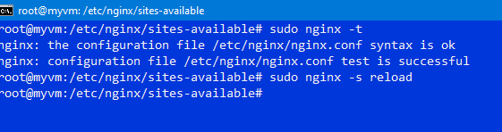


Damos permiso de ejecución y lo arrancamos

cd /var/demo/ubuntu.16.10-x64/publish/
chmod a+x ./Demo2Project
./Demo2Project

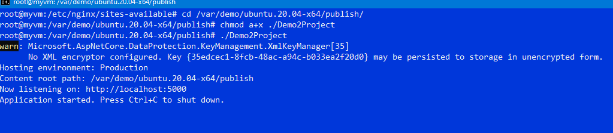


y probamos http://20.56.137.91/api/values

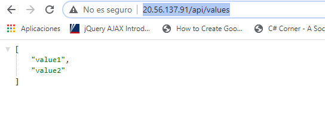