## Lesson 4: Deploying to Staging and Production Environments

### Demonstration: Using Deployment Slots with Web Apps

#### Demonstration Steps

Creamos una webapp

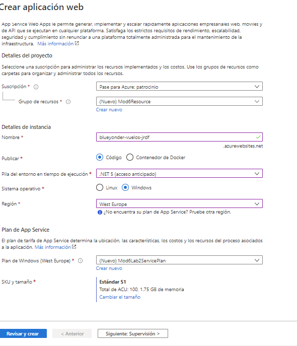


Vamos a congigurar para hacer deploy a traves de Ftp 


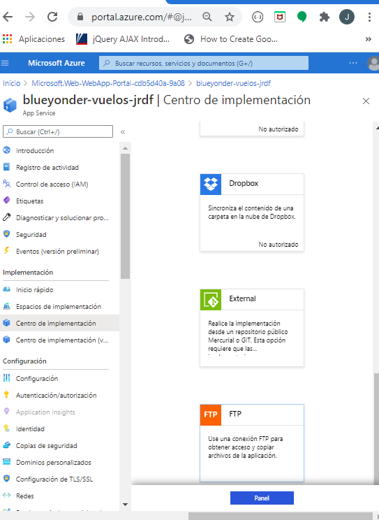

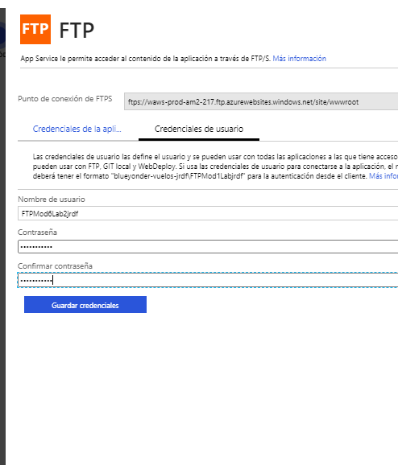


y esos datos lo vamos a copiar en el archivo [Properties/PublishProfiles/Azure.pubxml](SimpleServiceForDeploymentSlots/Properties/PublishProfiles/Azure.pubxml)

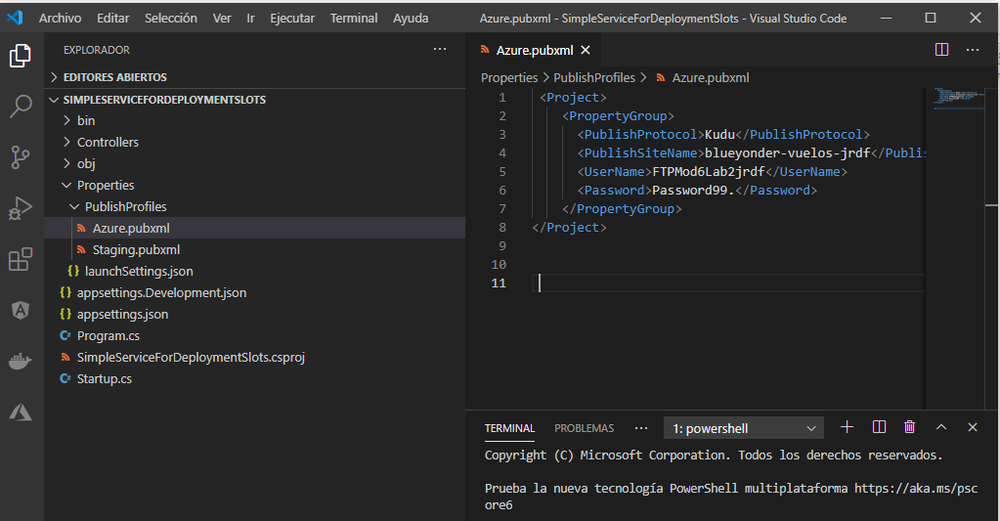


Publicmaos

    ```bash
    dotnet publish /p:PublishProfile=Azure /p:Configuration=Release
    ```
	
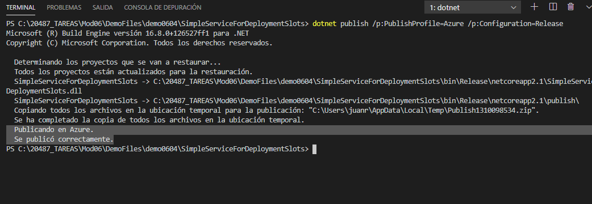

Probamos la aplicación

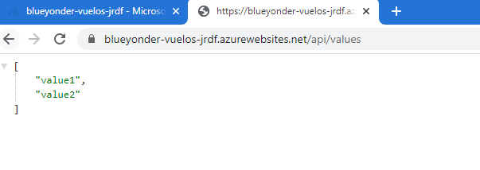

Creamos es stating slot

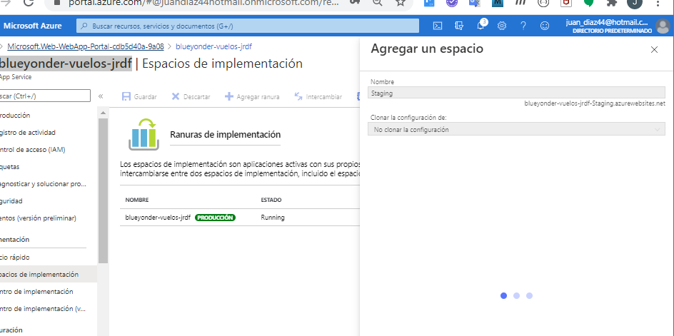

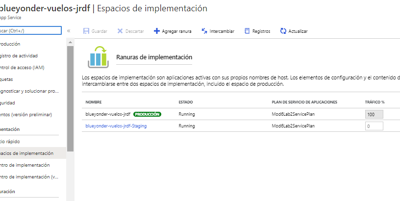


Modificamos el Valuecontroller 

 
   ```cs
        [HttpGet]
        public ActionResult<IEnumerable<string>> Get()
        {
            return new string[] { "Nueva version de value 1", "nueva Version de value 2" };
        }
   ```

Modificamos [Properties/PublishProfiles/Staging.pubxml](SimpleServiceForDeploymentSlots/Properties/PublishProfiles/Staging.pubxml)

   ```xml
	<Project>
		<PropertyGroup>
			<PublishProtocol>Kudu</PublishProtocol>
			<PublishSiteName>blueyonder-vuelos-jrdf-staging</PublishSiteName>
			<UserName>FTPMod6Lab2jrdf</UserName>
			<Password>Password99..</Password>
		</PropertyGroup>
	</Project>
   ```
6. To publish in the staging slot, at the command prompt, run the following code:
   ```bash
   dotnet publish /p:PublishProfile=Staging /p:Configuration=Release
   ```

ejectumaos la aplicación en Staging


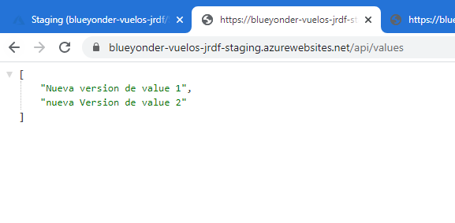


 Swapping the Environments


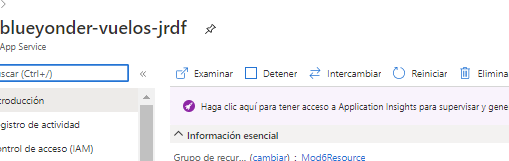

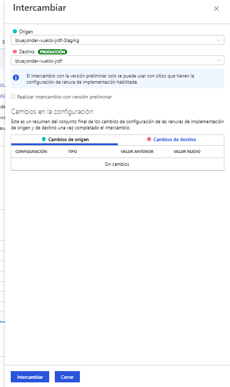

Probamos

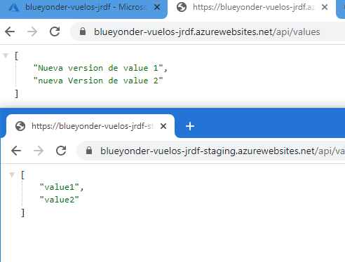


Deshacemos el Swap


Basta con volver a intercambiar

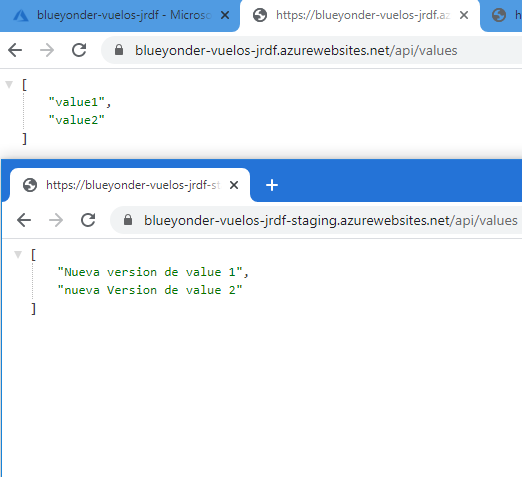.


Si vamos al web api vemos que tenemos logs (registros)

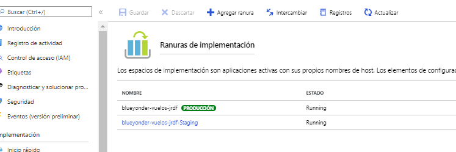.

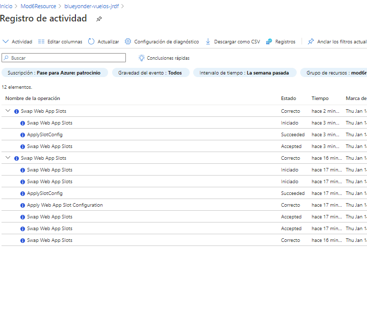.

