# Module 6: Deploying and Managing Services

# Lesson 3: Continuous Delivery with Microsoft Visual Studio Team Services

### Demonstration: Continuous Delivery to Websites with Git and Visual Studio Team Services

----

Modificamos el markdown porque ya no utilizamos TEAMS..

Los pasos son crear el webapp

crear el proyecto [ y Organización ] en https://dev.azure.com/ y la Pipeline

clonamos en VSCODE 

creamos el proyecto de net

Push

y en el centro de implementacion le indicamosmos el Azure Repos Pipilne


----

Creamos una web APP con la siguiente configuración
	
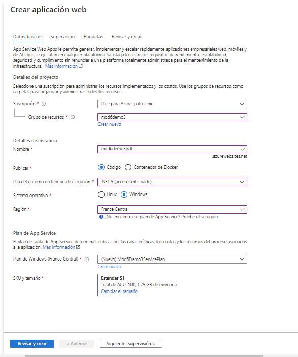	
	
En https://dev.azure.com/ Creamos una nueva Organizacion

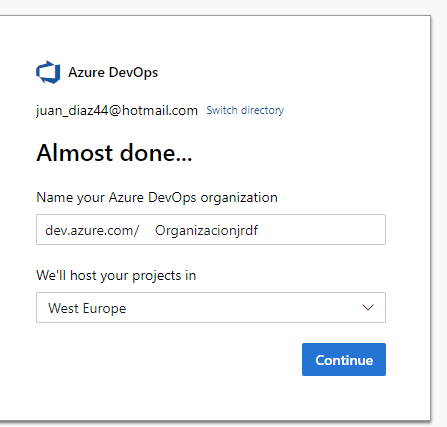	

y un nuevo proyecto 

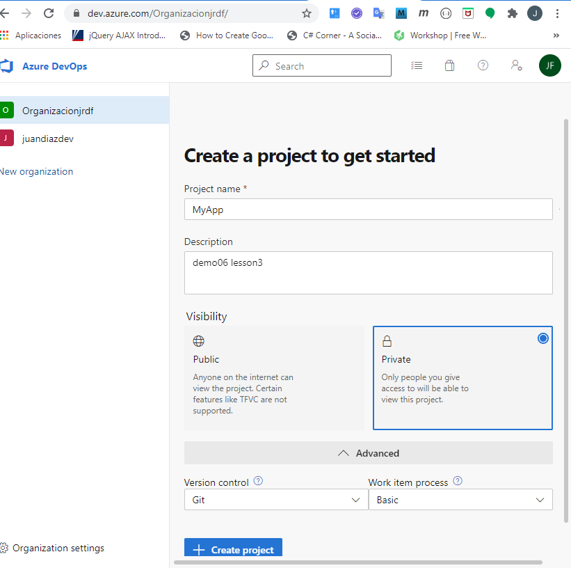


una vez creado nos vamos a remos y clonamos a VsCode

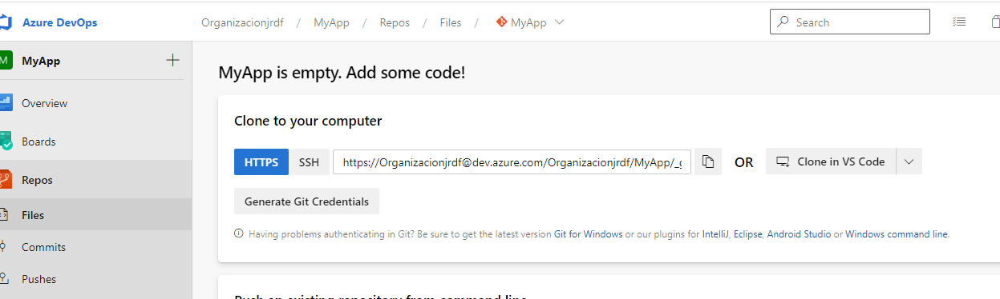

Permitimos que abra VsCode 

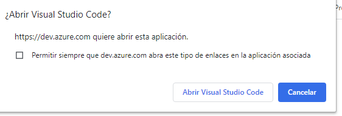

y elegimos la carpeta

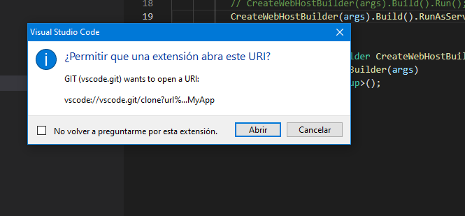

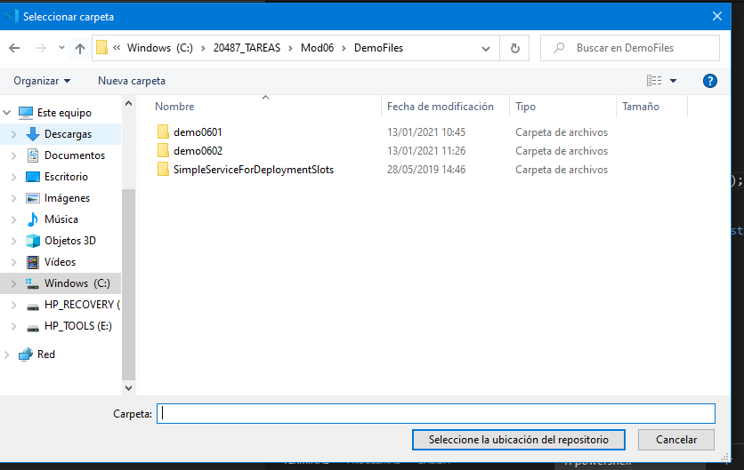
	
	
una vez clonado nos vamos a la canalización a Pipelines 

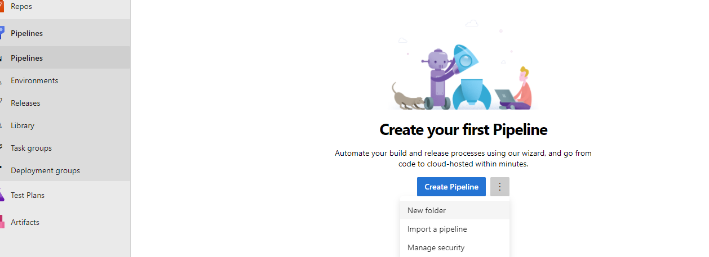

y creamos una nueva carpeta


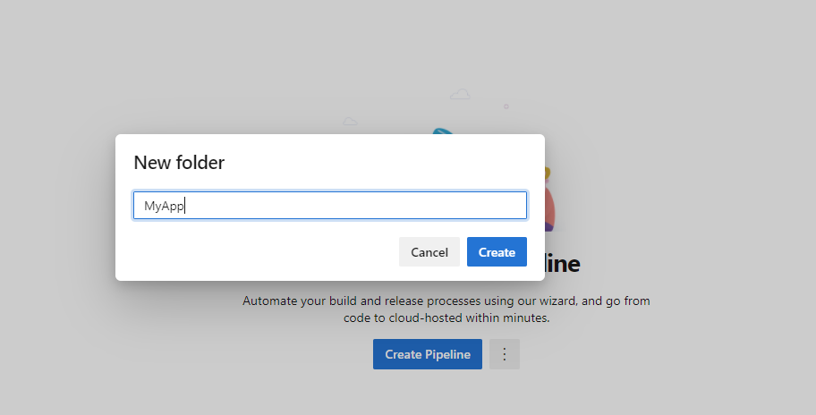


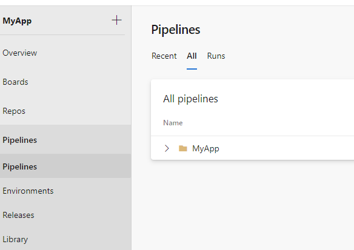


Volvemos al equipo y nos creamos un proyecto dotnet new webapi -n MyProject

(no ponemos -f porque por defecto nos crea net core 5 y es lo que le dimos en el webapp)


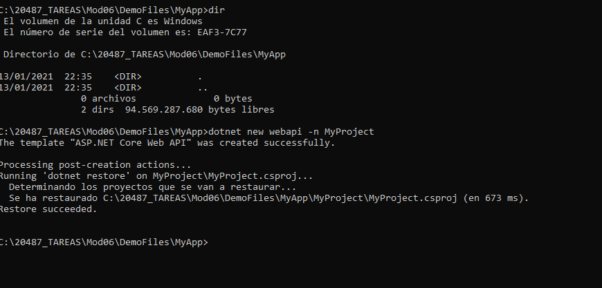


y agora le damos un push por code ó por consola 

    ```bash
    dotnet sln Mod6Demo3.sln add MyProject\MyProject.csproj


    git add .


    git commit -m "my first commit"
	
	
	git push
    ```

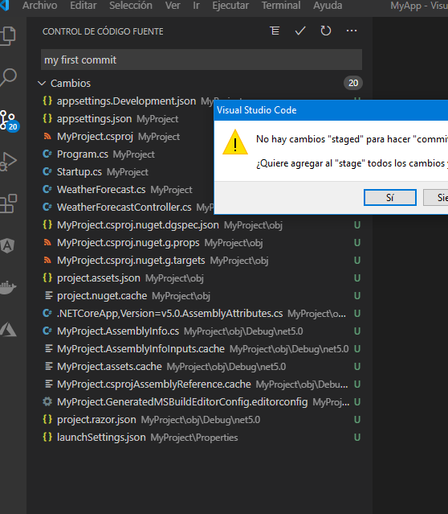	

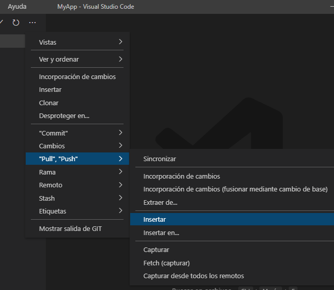	


comprobamos 
	
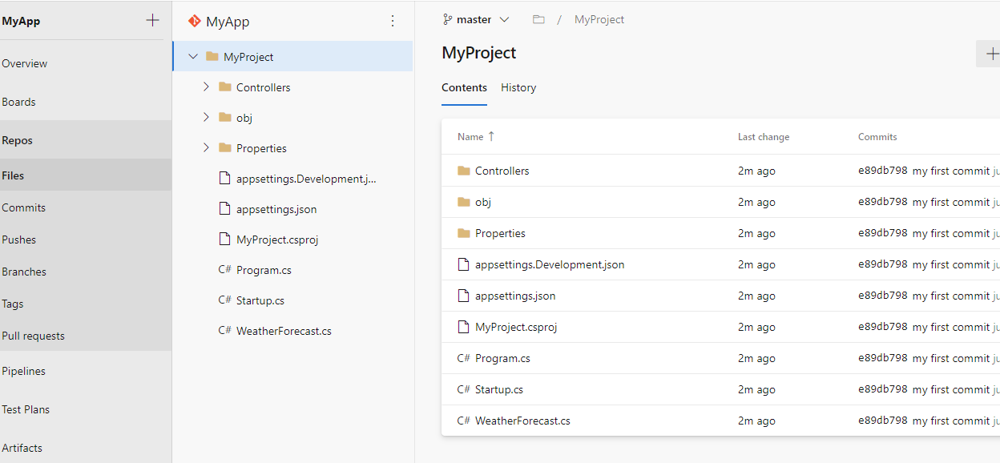	


Volvamos al portal de azure, abrimos la wev app 

y en el Deploy Center seleccionamos Azure Repos

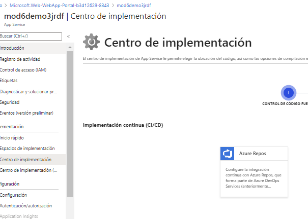	


continuamos y seleccionamos  Azure Pipelines


	
	

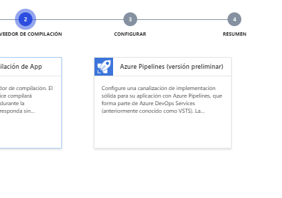		

Continuamos y Finish


Al poco rato

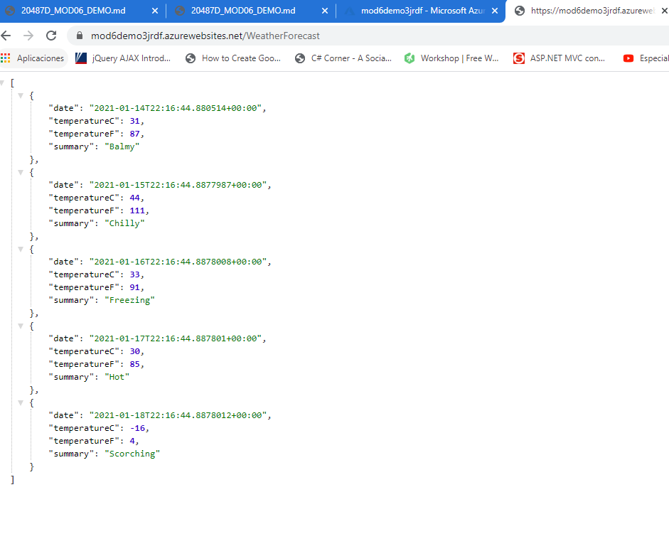

y ya esta cargado en nuesto web app

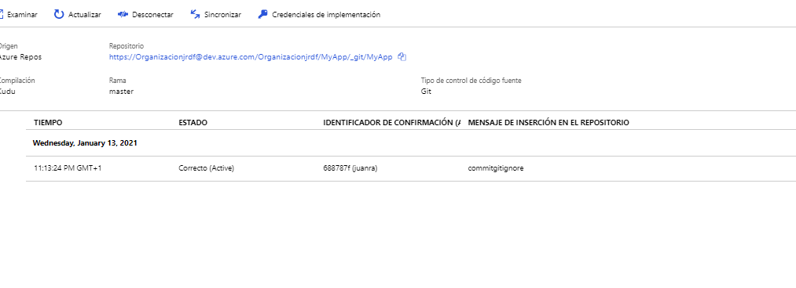


y funcionando

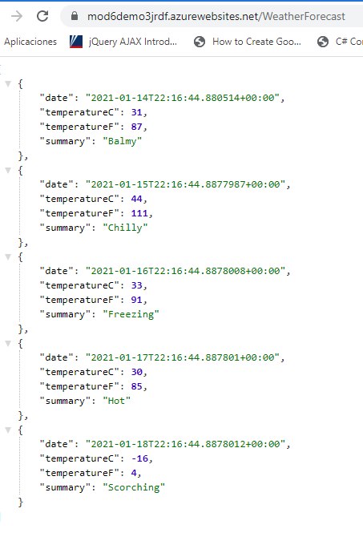

Modificamos el controlador y gacemos de nuevo un push


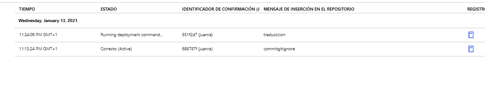

y modificado

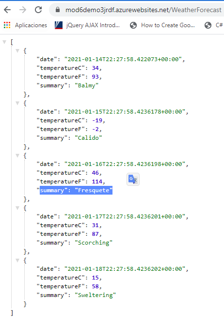


Resumiendo a traves de Azure Git se despliega la aplicación en el mimento que hacemos un push.


	