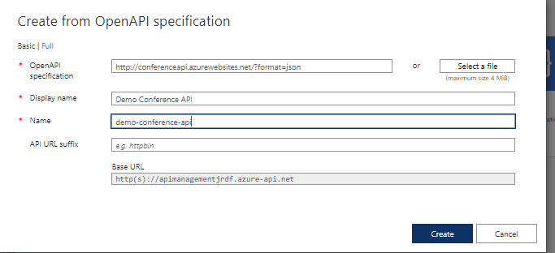

## Module 6: Deploying and Managing Services

### Lesson 5: Defining Service Interfaces with Azure API Management

#### Demonstration: Importing and Testing an OpenAPI Specification & Limiting Call Rates Using API Management

Creamos un aP Management con la siguiente configuración

una vez creado nos vamos a Apis + Api y le añadimos una api OpenAPI

con la siguiente cofiguración

vemos que nos la ha añadido y nos expone todos sus metodos y podeos testearlos

vemos lo que nos devuelve

Pero ahora vamos a añadirlo una politica a la Gestion

lo podemos hacer a traves del icono "</>" o através de Add Policy

vamos añadir una politica Limit call rate

que sólo pueda hacer 2 llamadas cada 60 segundo

A través de  "</>" nos abre el xml y lo podríamos teclear directamente 

Bueno pues vamos a probarla ejecutando 3 veces e menos de 60 segundos

Error 429 Too Many Request!!

