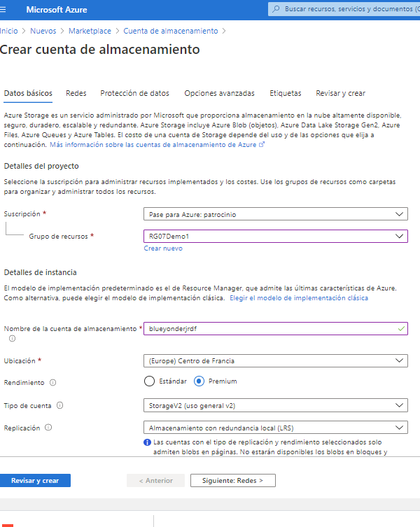
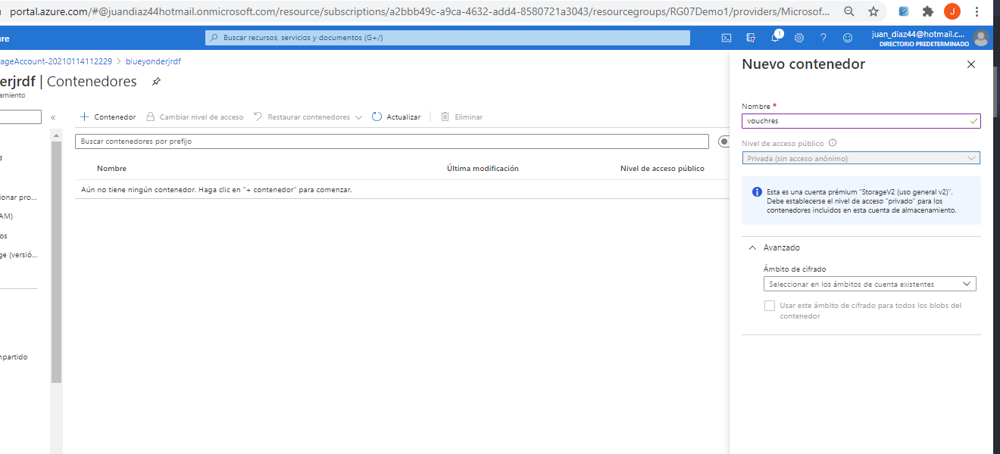
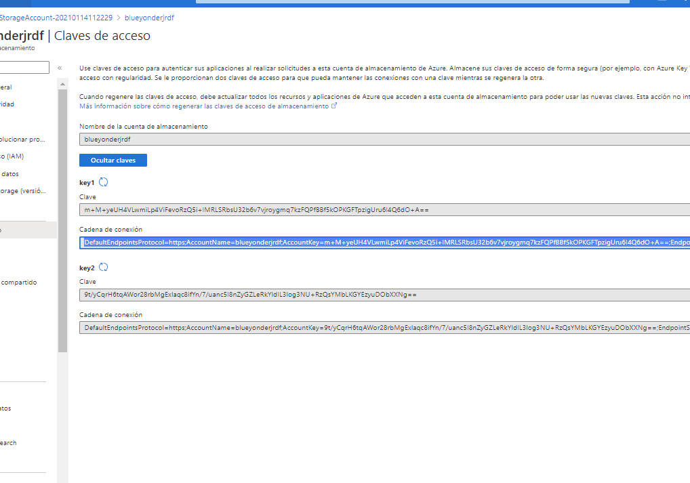
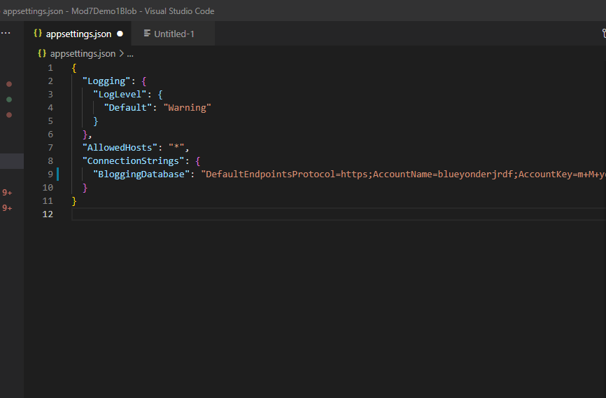
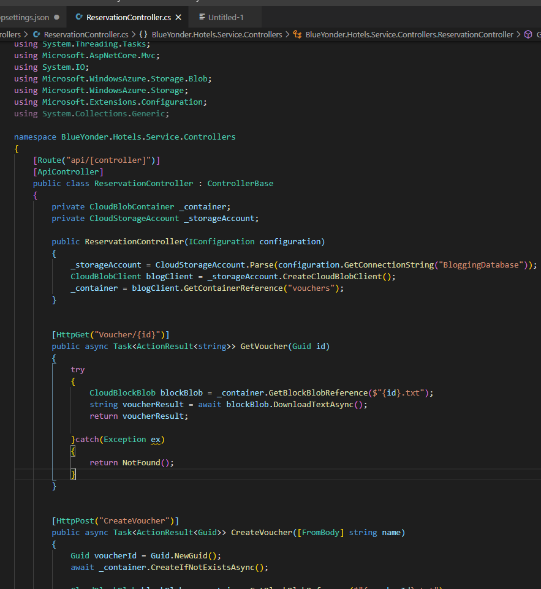
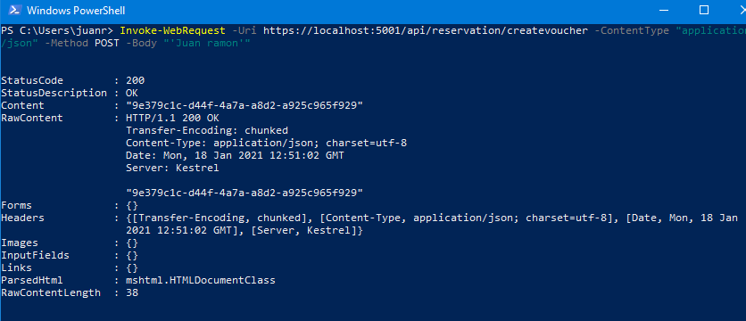
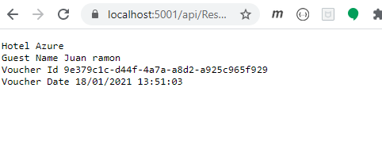

### Módulo 7: Implementación del almacenamiento de datos en Azure

####  Lección 2: Acceso a datos en Azure Storage

##### Demostración: Acceso a Microsoft Azure Blob Storage desde una aplicación Microsoft ASP.NET Core

