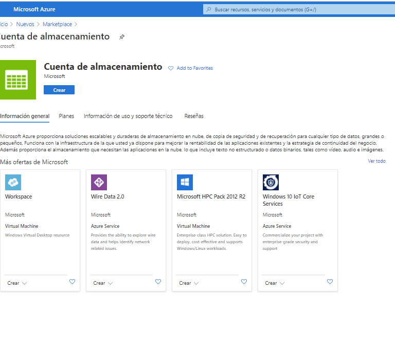
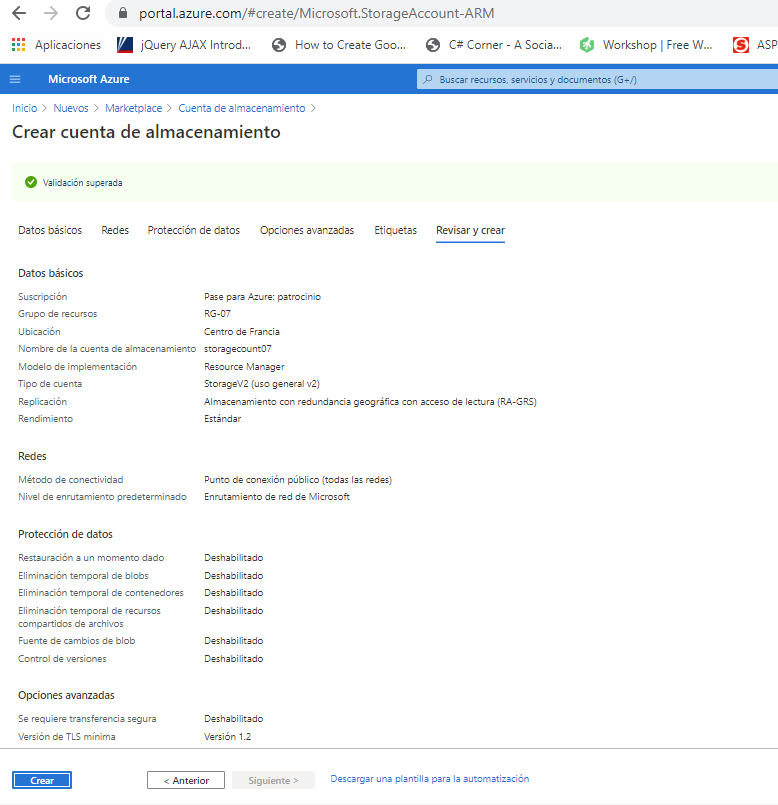
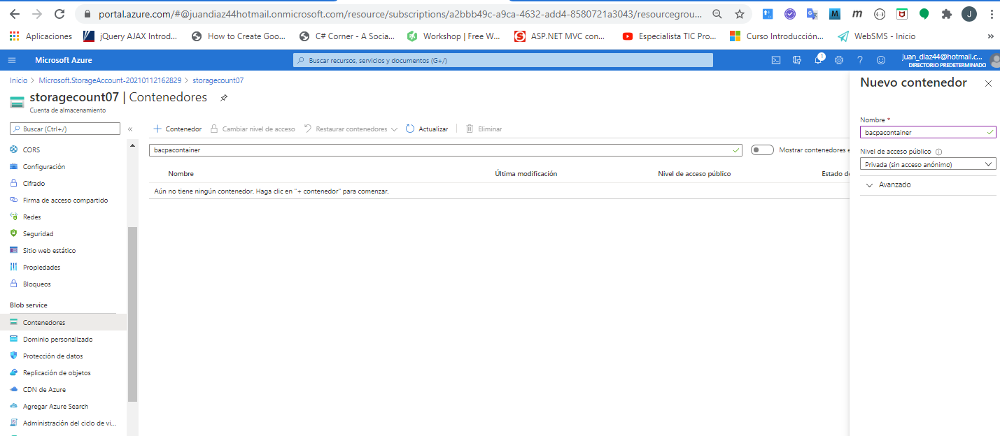
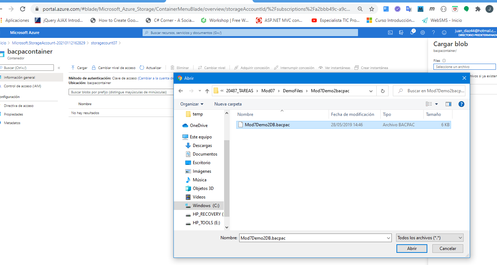
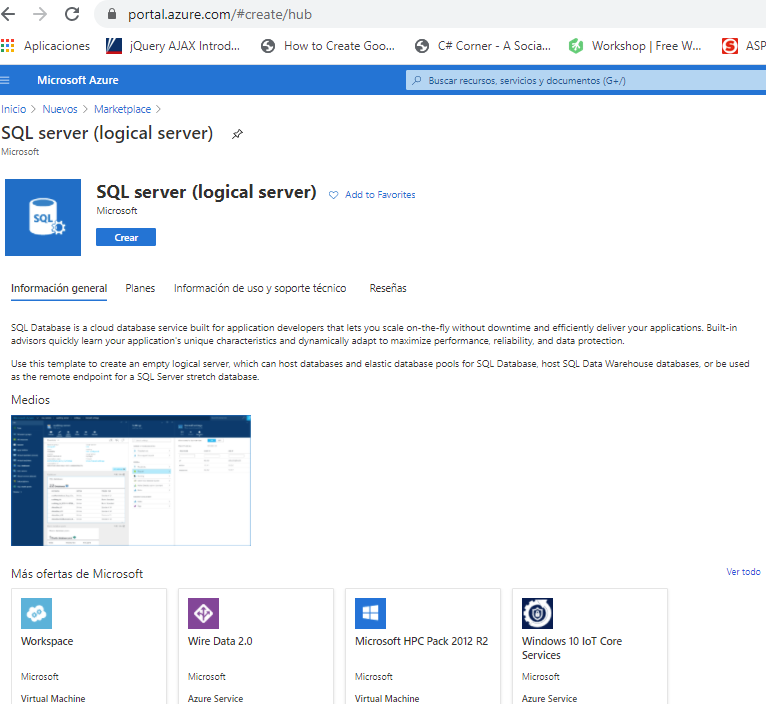
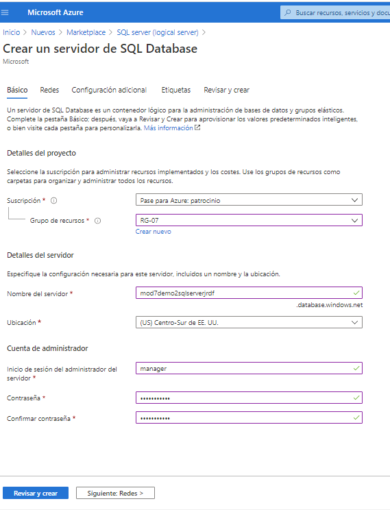
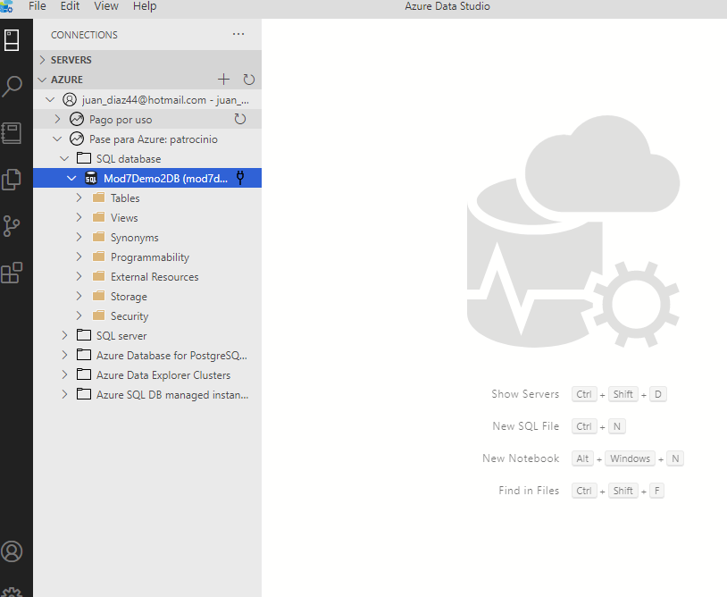

## Module 7: Implementing data storage in Azure

### Lesson 3: Working with Structured Data in Azure

#### Demonstration: Uploading an Azure SQL Database to Azure and Accessing it Locally

creamos una nueva cuenta de almacenamiento

con la siguiente configuración

en contenedores nos creamos un nuevo contenedor llamado bacapcontainer

y cargamos el fichero bacpac (es un  fichero de aplicación de capa de datos (DAC de SQL SERVER))

Ahora creamos un recurso SQL server

con la siguiente configuración

una vez creado el servidor  importamos la base de datos desde el contenedor bacapcontainer

y finalmente nos acrodamos de confifurar el firewall de la base de datos para poder acceder a ella

ya podemos acceder a dicha base de datos desde un cliente como AZURE DATA STUDIO ó SQL SERVER, etc..

