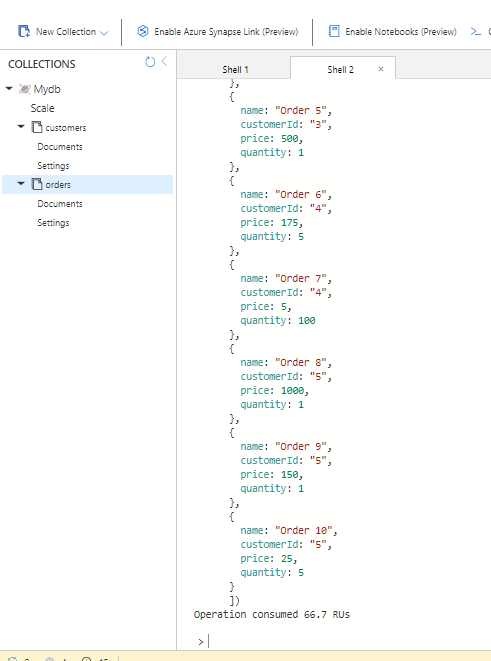
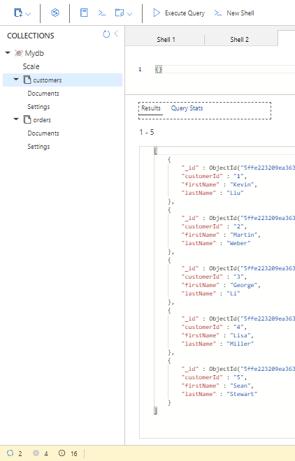

## Module 7: Implementing data storage in Azure

### Lesson 3: Working with Structured Data in Azure

#### Demonstration: Using Microsoft Azure Cosmos DB with the MongoDB AP

Creamos un nuevo recurso COSMOS DB

con la siguiente configuración (importante la APi de MongoDB) ;)

Nos vamos al Explorador de datos y creamos una nueva coleccion

les metemos las colecciones  customer y orders 

(ojo con los nombres de campos y colleciones pues son CASESENSITIVE

Para añadirle datos podemos coger el fichero CustomersCollectionData.json, abrirlo y copiar su contenido.
Abrimos un nuevo shell en la coleccione customer, pegamos el contenido del fichero y pulsamos intro

Lo mismo para orders

finalmente podemos ver los datos ejecutando un query de Mongo

