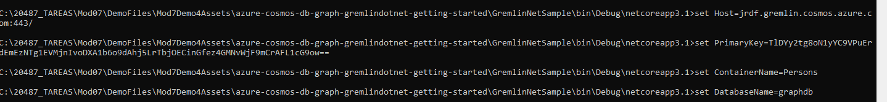
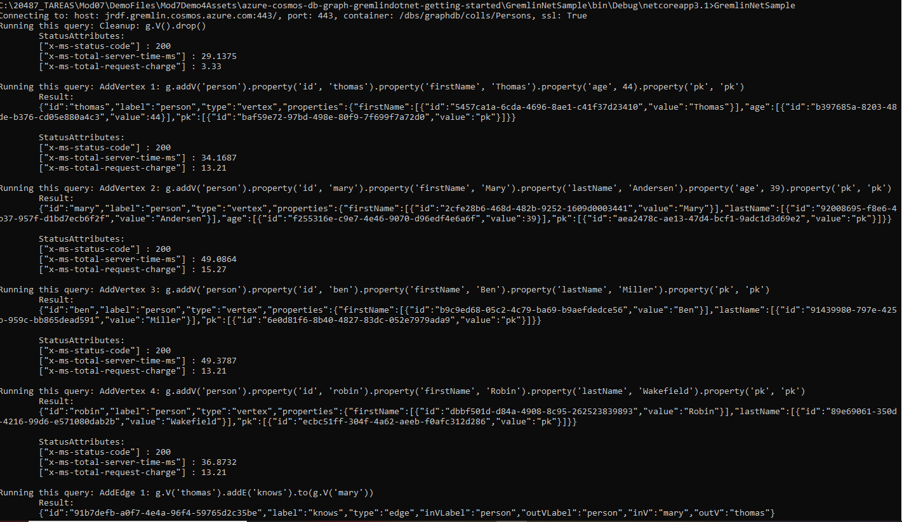
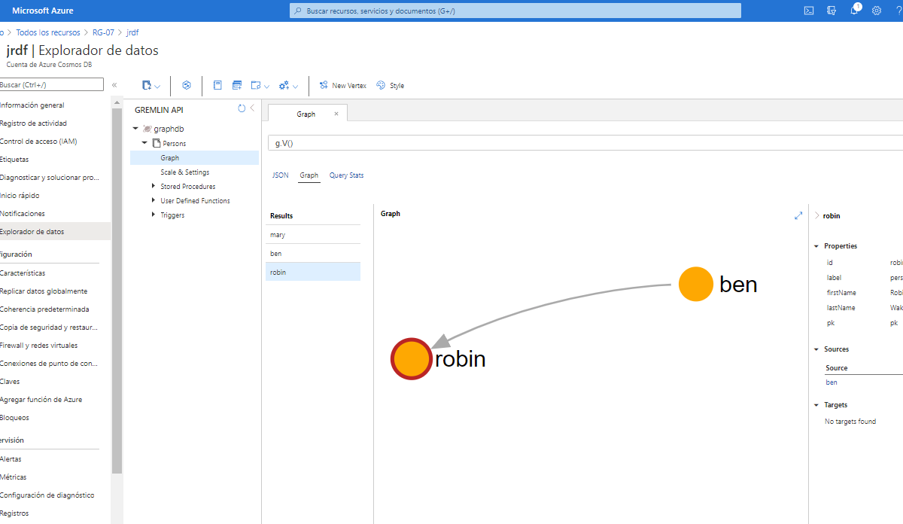

# Quickstart: Build a .NET Framework or Core application using the Azure Cosmos DB Gremlin API account

## [Instruccions](https://docs.microsoft.com/en-us/azure/cosmos-db/create-graph-dotnet)


## Eviroments variable from CMD

```
Copy from Portal Azure CosmosDb Gremmling database->graphdb and create enviroment variable:
set DatabaseName=graphdb

Copy from Portal Azure "Data Explorer" graphdb->Persons and create enviroment variable
set ContainerName=Persons

Copy from Portal Azure Gremlin Endpoint and create enviroment variable:
set Host=mod7demo4.gremlin.cosmos.azure.com

Copy from Portal Azure Settings->Keys->Primary Key and create enviroment variable
set PrimaryKey=iknXcjyB38t2D6MQkYTjaq4rIKCDwJUHKSIeVZpfej90RlL32i1chioiurBwXixdAg3iCkUgAEVVsC4YL2MnSQ==
```

[Gremlin Query Language - JanusGraph](https://docs.janusgraph.org/basics/gremlin/)


Despues de crear los recursos y el grafo damos valor a las variables de entorno



compilamos la solucion y la ejecutamos



y verificamos que han subido los datos




