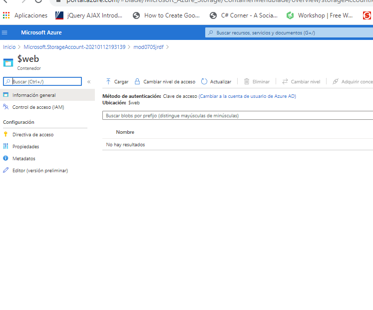

## Module 7: Implementing data storage in Azure

### Lesson 4: Geographically Distributing Data with Azure CDN

#### Demonstration: Configuring a CDN Endpoint for a Static Website

Lo primero de todo es verificar si tenemos el servicio de CDN registrado para nuestra suscripción y si no lo registramos (subscripcion + Proveedores de recursos)

creamos una cuenta de almacenamiento con la siguiente configuracion

Una vez creada vamos al recurso y habilitamos el sitio web estático

Al guaradar verás que ha creado un contenedor $web, puedes acceder a él desde allí o directamente a través de contenedores

Cargamos las imagenes y la página index.html que tenemos en C:\20487_TAREAS\Mod07\DemoFiles\Mod7Demo5Assets

y lo probamos desde el punto de conexíon princial que la pantalla de sitio web estatico

Bueno pues ahora creamos el CDN

Con la siguiente configuración

y ya tenemos cargado el CDN

Puedes comprobar , despues de cargarla, el valor del atributo x-cache: TCP_HIT

