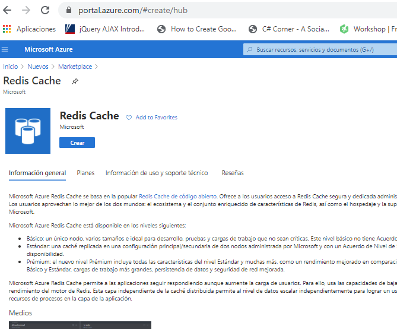
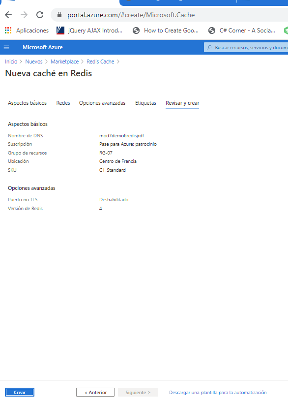
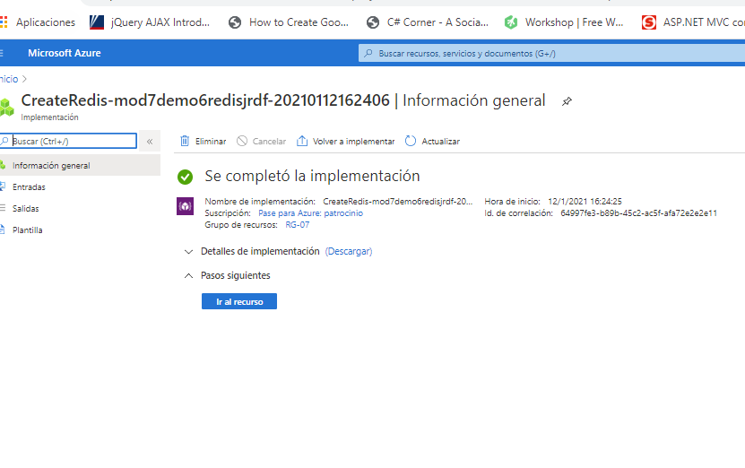
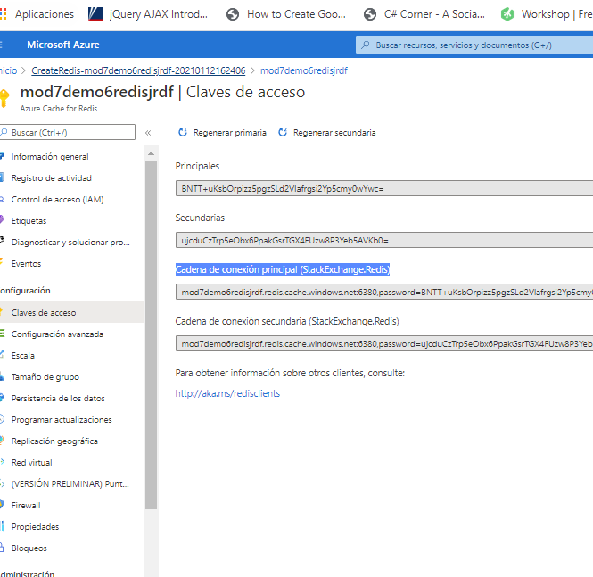
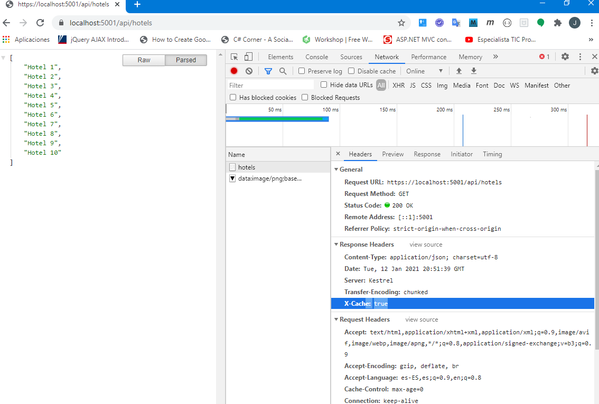
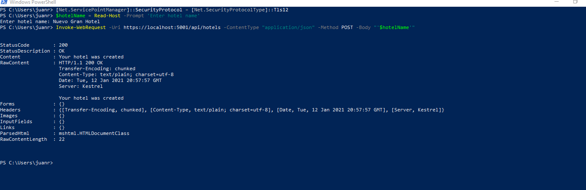
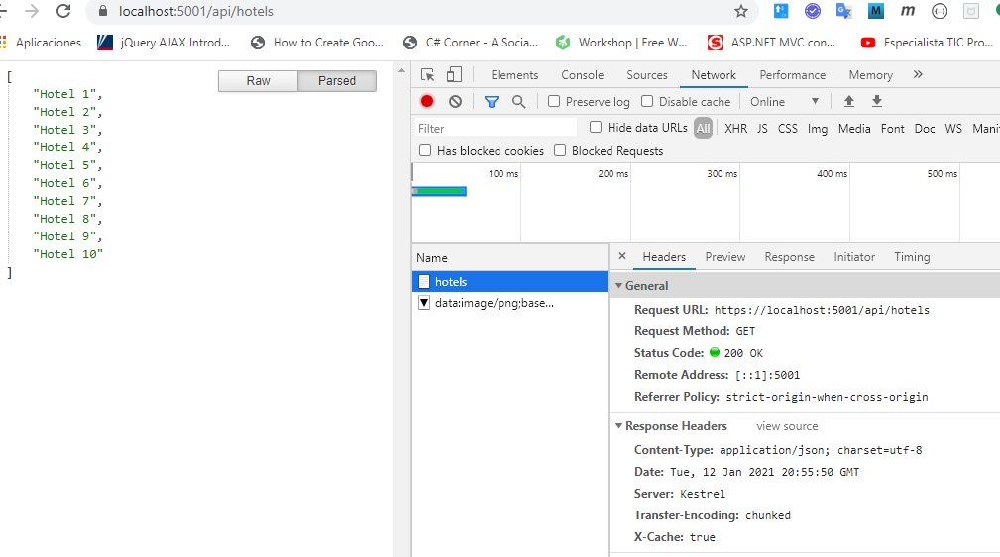
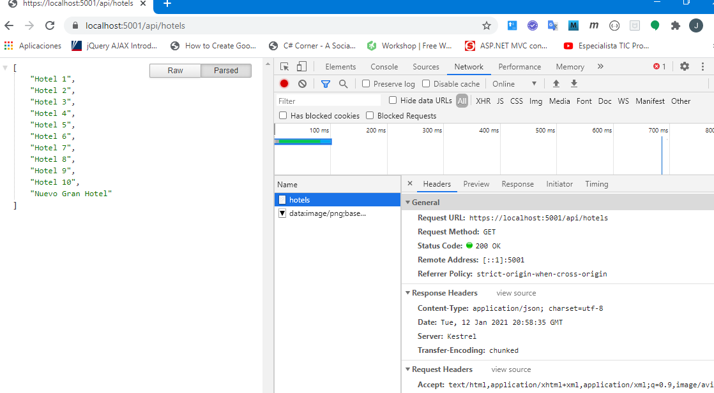

## Module 7: Implementing data storage in Azure

### Lesson 5: Scaling with Out-of-Process Cache

#### Demonstration: Using Microsoft Azure Redis Cache for Caching Data


Creamos un azure redis cache 





este recurso tarda en crearse pero una vez creado vampos al recurso y copiamos la cadena de conexión princial



 y copiamos la cadena de conexión princial (desde claves de acceso)




abrimos el fichero [BlueYonder.Hotels.Service/appsettings.json](BlueYonder.Hotels.Service/appsettings.json) y le metemos la cadena de conexión copiada


```xml

{
  "Logging": {
    "LogLevel": {
      "Default": "Warning"
    }
  },
  "AllowedHosts": "*",
  "ConnectionStrings": {
    "RedisConnectionString": "mod7demo6redisjrdf.redis.cache.windows.net:6380,password=BNTT+uKsbOrpizz5pgzSLd2Vlafrgsi2Yp5cmy0wYwc=,ssl=True,abortConnect=False"
  }
}

```

echamos un vistazo a [Startup.cs](BlueYonder.Hotels.Service/Startup.cs) para ver como ha registrado reddis

y miramos [HotelsController.cs](BlueYonder.Hotels.Service/Controllers/HotelsController.cs) para ver como utiliza la cache

```c#
 private readonly IDatabase _chache;
        private IHotelRepository _hotelRepository;

        public HotelsController(IConnectionMultiplexer connectionMultiplexer, IHotelRepository hotelRepository)
        {
            _chache = connectionMultiplexer.GetDatabase();
            _hotelRepository = hotelRepository;
        }


        [HttpGet]
        public ActionResult<IEnumerable<string>> Get()
        {
            string key = Request.Path;
            // Get the data from the cache.
            RedisValue result = _chache.StringGet(key);

            if (result.HasValue)
            {
                // Return data from the cache. 
                Response.Headers.Add("X-Cache", "true");
                return Ok(JsonConvert.DeserializeObject(result));
            }

            List<string> hotels = _hotelRepository.GetHotelList();
            // Insert the data to the cache by key. 
            _chache.StringSet(key, JsonConvert.SerializeObject(hotels), new TimeSpan(0, 1, 0));
            return Ok(hotels);
        }
		....
````

finalmente lo probamos 

despues de recrgar la página vemos que tira de cache



insertamos desde consola 



Pero vemos que sigue tirando de cache




Esperamos un minuto y ya la tenemos refrecada


