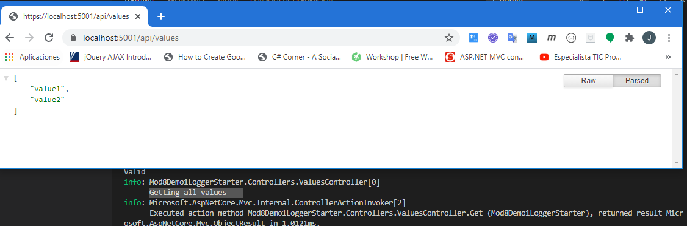
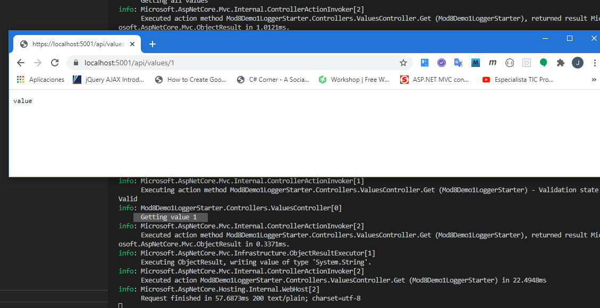

### Module 10: Monitoring and Diagnostics

#### Lesson 1: Logging in ASP.NET Core


#### Demonstration: Recording logs to the Console and EventSource providers


Nos creamos una web api core 2.1

dotnet new webapi -n Mod8Demo1LoggerStarter -f netcoreapp2.1


la hecemos un dotnet restore

y abrimos con code 


Modicados el CreateWebHostBuilder  de [Program.cs](Mod8Demo1LoggerStarter/Program.cs) con el ConfigureLogging

```c#
	public static IWebHostBuilder CreateWebHostBuilder(string[] args) =>
            WebHost.CreateDefaultBuilder(args)
                .ConfigureLogging((hostingContext, logging) => 
                    {
                        logging.AddConsole();
                        logging.AddEventSourceLogger();
                    })
                .UseStartup<Startup>();
    }
```


Injectamos ILogger  en el [ValuesController.cs](Mod8Demo1LoggerStarter/Controllers/ValuesController.cs)

```c#
....
using Microsoft.Extensions.Logging;
......
public class ValuesController : ControllerBase
    {
        private readonly ILogger _logger;
        public ValuesController(ILogger<ValuesController> logger)
        {
            _logger = logger;
        }
.........

````


y modicamos los get añadiendo un _ logger.information

```c#
[HttpGet]
public ActionResult<IEnumerable<string>> Get()
{
	_logger.LogInformation("Getting all values");
	return new string[] { "value1", "value2" };
}

// GET api/values/5
[HttpGet("{id}")]
public ActionResult<string> Get(int id)
{
	_logger.LogInformation($"Getting value {id}");
	return "value";
}
.........

````		


lo ejecutamos y comprobamos




